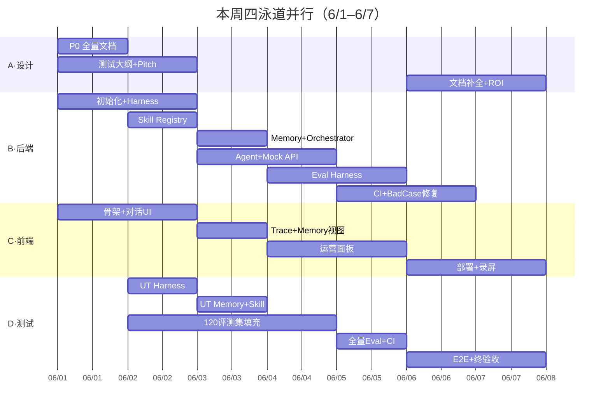
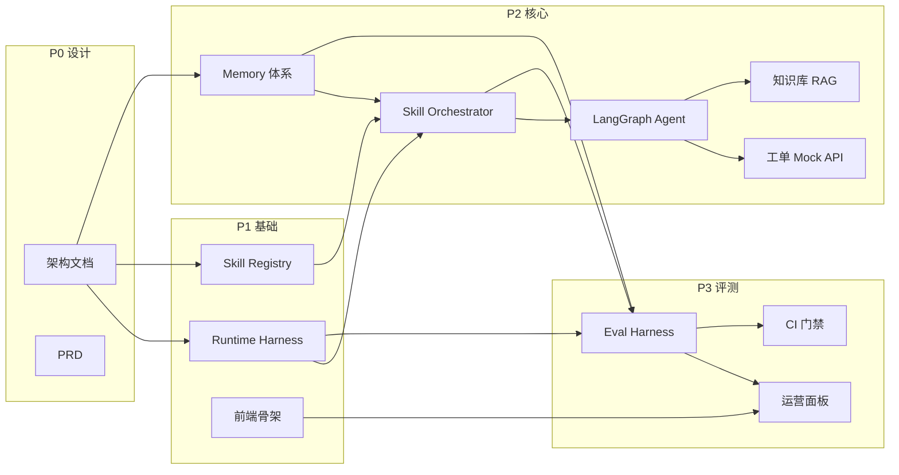

# 智服通 AgentOps — 开发与测试计划

> 本文档是 [PROJECT_PLAN.md](./PROJECT_PLAN.md) 的执行细化版，按 **Skill / Harness / Memory** 三大核心模块拆解开发任务与测试策略。
>
> **排期模式**：**本周 7 天冲刺（2026/6/1 – 6/7）** — 原 4 周计划**全量保留、零裁剪**，通过**四泳道并行 + 测试左移 + Vibe Coding** 压缩交付。

---

## 一、计划总览

### 1.1 周期与里程碑（本周冲刺版）

| 阶段 | 原周期 | **本周映射** | 目标 | 里程碑 |
|------|--------|-------------|------|--------|
| **P0 设计** | Week 1 | **6/1（周一）上午** | 架构与 PRD 定稿 | M0：12:00 设计评审通过 |
| **P1 基础骨架** | Week 2 前半 | **6/1 下午 – 6/2** | Harness + Skill Registry + 前端 | M1：6/2 20:00 单 Skill 可调用 |
| **P2 核心闭环** | Week 2 后半 | **6/3 – 6/4 上午** | Agent + Memory + 端到端 | M2：6/4 14:00 MVP 可演示 |
| **P3 评测与运营** | Week 3 | **6/4 下午 – 6/5** | Eval Harness + 120 集 + CI | M3：6/5 20:00 评测门禁上线 |
| **P4 交付打包** | Week 4 | **6/6 – 6/7** | 部署 + 录屏 + 文档 | M4：6/7 18:00 作品集可投递 |

**本周日历锚点**：

| 日期 | 星期 | 代号 | 主题 |
|------|------|------|------|
| 6/1 | 周一 | **S1** | 设计定稿 + 基建开工 |
| 6/2 | 周二 | **S2** | Harness / Skill / 前端骨架 |
| 6/3 | 周三 | **S3** | Memory + Agent 核心闭环 |
| 6/4 | 周四 | **S4** | 联调 MVP + Eval Harness 启动 |
| 6/5 | 周五 | **S5** | 120 评测集 + CI + 运营面板 |
| 6/6 | 周六 | **S6** | 部署 + E2E + Bad Case 修复 |
| 6/7 | 周日 | **S7** | 录屏 + 文档 + M4 终验收 |

### 1.2 开发原则（冲刺模式）

1. **四泳道并行**：设计 / 后端 / 前端 / 测试评测同时推进，不等阻塞
2. **文档与代码并行**：设计文档用 Cursor 生成骨架，当天代码验证
3. **Skill 先行**：Manifest 先于 Orchestrator，Orchestrator 先于 Agent
4. **Harness 贯穿**：Runtime Harness 6/1 下午即嵌入，Eval 与生产共享 Validator
5. **测试左移**：每个 DEV 任务完成 → 2h 内补齐对应 UT/ST 用例
6. **每日 Demo 增量**：每天 20:00 必须有一个可录屏的新增能力
7. **评测集流水线**：6/1 出 120 条大纲 → 6/2–6/4 随 Skill 交付同步填充 → 6/5 全量跑通
8. **Vibe Coding 优先**：能用 Cursor 批量生成的（Manifest / 评测 YAML / Mock 数据）不手写

### 1.3 四泳道分工

| 泳道 | 职责 | 负责模块 | 峰值日 |
|------|------|----------|--------|
| **A · 设计** | 13 份文档 + ADR + 测试大纲 | `docs/` | S1 |
| **B · 后端** | Harness / Skill / Memory / Agent / API | `harness/` `skills/` `memory/` `agent/` `backend/` | S2–S4 |
| **C · 前端** | 对话 UI / 运营面板 / Trace 可视化 | `frontend/` | S2–S6 |
| **D · 测试** | UT / ST / ET / E2E / CI | `evaluation/` `harness/eval/` `.github/` | S2–S7 |



### 1.3 技术栈

| 层级 | 选型 | 说明 |
|------|------|------|
| 前端 | Next.js 14 + Tailwind + shadcn/ui | 对话 UI + 运营后台 |
| 后端 | FastAPI + Python 3.11 | Agent 代理 / API / Memory Store |
| Agent 编排 | LangGraph | Multi-Agent + Skill 有向图 |
| 向量库 | Chroma / Qdrant（本地） | Semantic Memory / RAG |
| 关系库 | SQLite（Demo）/ PostgreSQL | 工单 / Trace / Memory |
| LLM | OpenAI API / 兼容接口 | 可 Mock 用于 Eval |
| CI | GitHub Actions | Eval Harness 门禁 |
| 部署 | Vercel + Railway | 在线 Demo |

---

## 二、模块依赖关系



**关键路径（本周）**：6/1 设计定稿 → 6/2 Harness+Skill → 6/3 Memory+Agent → 6/4 联调 → 6/5 Eval+CI → 6/7 交付

---

## 三、开发计划（按模块 · 全量任务清单）

> 以下 DEV-001 ~ DEV-407 **全部保留**，仅映射到本周日程。对照 **§五 本周冲刺日程** 查看每日执行顺序。

### 3.1 P0 设计阶段 → **S1（6/1 上午）**

| ID | 任务 | 产出 | 负责人 | 验收标准 |
|----|------|------|--------|----------|
| DEV-001 | 需求挖掘案例 | `docs/08-requirement-discovery-case.md` | PM | 含 5 Whys + 干系人 + Trade-off |
| DEV-002 | Agent 架构设计 | `docs/01-agent-architecture.md` | PM | Agent/Skill/Tool 三层图完整 |
| DEV-003 | Skill 体系设计 | `docs/13-skill-design.md` | PM | 12 Skill 边界矩阵 + 编排 ADR |
| DEV-004 | Harness 设计 | `docs/12-harness-design.md` | PM | Runtime + Eval 双 Harness 流程图 |
| DEV-005 | Memory 设计 | `docs/11-memory-design.md` | PM | 四层 Memory + Router + Policy |
| DEV-006 | 主 PRD | `docs/02-PRD-智服通AgentOps.md` | PM | 功能/非功能/里程碑/风险 |
| DEV-007 | 流程与状态机 | `docs/03-workflow-and-state-machine.md` | PM | 工单状态机 + 异常路径 |
| DEV-008 | 权限与数据流 | `docs/04-permission-and-data-flow.md` | PM | RBAC 矩阵 + 数据流图 |
| DEV-009 | ADR + 失效手册 | `docs/06-*` + `docs/05-*` | PM | ≥5 条 ADR + 失效诊断路径 |

**P0 出口准则**：设计评审通过，开发可依据文档开工，无阻塞性待定项。

---

### 3.2 P1 基础骨架 → **S1 下午 – S2（6/1 14:00 – 6/2）**

#### 3.2.1 Runtime Harness

| ID | 任务 | 文件/目录 | 依赖 | 验收 |
|----|------|-----------|------|------|
| DEV-101 | 项目初始化 | 根目录 + `pyproject.toml` / `package.json` | DEV-004 | 本地可启动 |
| DEV-102 | Input Guardrail | `harness/runtime/guardrail/input.py` | DEV-101 | 敏感词/PII/注入拦截单测通过 |
| DEV-103 | Output Guardrail | `harness/runtime/guardrail/output.py` | DEV-101 | 无来源引用时阻断 |
| DEV-104 | Tool Validator | `harness/runtime/tool_validator.py` | DEV-101 | JSON Schema 校验 + 3 次重试 |
| DEV-105 | Trace Recorder | `harness/runtime/trace.py` | DEV-101 | 每次调用产出结构化 Trace |
| DEV-106 | Step Limiter + Retry | `harness/runtime/executor.py` | DEV-104 | 超步数/超时正确降级 |

#### 3.2.2 Skill Registry

| ID | 任务 | 文件/目录 | 依赖 | 验收 |
|----|------|-----------|------|------|
| DEV-111 | Manifest Schema 定义 | `skills/manifests/schema.json` | DEV-003 | 12 Manifest 可校验 |
| DEV-112 | 核心 3 Skill Manifest | `intent-classify` / `ticket-create` / `knowledge-retrieve` | DEV-111 | boundary 字段完整 |
| DEV-113 | Skill Registry 加载器 | `skills/runtime/registry.py` | DEV-112 | 按 id/version 加载 |
| DEV-114 | Skill Executor 骨架 | `skills/runtime/executor.py` | DEV-113, DEV-106 | 单 Skill 可独立 invoke |
| DEV-115 | 剩余 9 Skill Manifest | `skills/manifests/*.yaml` | DEV-112 | 12 个全部注册 |

#### 3.2.3 前端骨架

| ID | 任务 | 文件/目录 | 依赖 | 验收 |
|----|------|-----------|------|------|
| DEV-121 | Next.js 项目初始化 | `frontend/` | DEV-101 | dev server 可访问 |
| DEV-122 | 对话 UI 组件 | `frontend/components/chat/` | DEV-121 | 多轮消息 + 来源引用位 |
| DEV-123 | API 代理层 | `frontend/app/api/` | DEV-121 | 可转发至 backend |
| DEV-124 | 基础布局 + 路由 | `frontend/app/` | DEV-121 | 对话 / 后台 / 评测 三页 |

**P1 出口准则（M1）**：`intent-classify` Skill 可通过 Harness 独立调用并产出 Trace。

---

### 3.3 P2 核心闭环 → **S3 – S4 上午（6/3 – 6/4 14:00）**

#### 3.3.1 Memory 体系

| ID | 任务 | 文件/目录 | 依赖 | 验收 |
|----|------|-----------|------|------|
| DEV-201 | Working Memory Store | `memory/stores/working.py` | DEV-101 | 会话级读写 + 8 轮摘要 |
| DEV-202 | Episodic Memory Store | `memory/stores/episodic.py` | DEV-201 | 90 天 TTL + 摘要写入 |
| DEV-203 | Profile Memory Store | `memory/stores/profile.py` | DEV-101 | VIP/套餐/偏好可读 |
| DEV-204 | Semantic Memory（RAG） | `memory/stores/semantic.py` | DEV-101 | 向量检索 + 来源引用 |
| DEV-205 | Memory Router | `memory/router/router.py` | DEV-201–204 | 按 Skill.memory_deps 注入 |
| DEV-206 | Write/Forget Policy | `memory/policies/` | DEV-202 | PII 脱敏 + 冲突解决 |
| DEV-207 | Memory Injector（Harness） | `harness/runtime/memory_injector.py` | DEV-205, DEV-106 | Trace 含 Memory 注入明细 |

#### 3.3.2 Skill Orchestrator + Agent

| ID | 任务 | 文件/目录 | 依赖 | 验收 |
|----|------|-----------|------|------|
| DEV-211 | Skill 有向图定义 | `skills/orchestrator/graph.yaml` | DEV-115 | 编排逻辑与 ADR 一致 |
| DEV-212 | Skill Orchestrator | `skills/orchestrator/orchestrator.py` | DEV-114, DEV-211 | 按图调度 + Fallback |
| DEV-213 | LangGraph 路由 Agent | `agent/router_agent.py` | DEV-212 | intent → agent 路由 |
| DEV-214 | 咨询 Agent Workflow | `agent/consult_agent.py` | DEV-212 | retrieve → compose 链路 |
| DEV-215 | 工单 Agent Workflow | `agent/ticket_agent.py` | DEV-212 | create / query 分支 |
| DEV-216 | 升级 Agent Workflow | `agent/escalation_agent.py` | DEV-212 | judge → handoff 链路 |
| DEV-217 | Skill 级 Prompt 模板 | `skills/prompts/` | DEV-115 | 12 Skill 各有 Prompt |

#### 3.3.3 业务 Mock + 知识库

| ID | 任务 | 文件/目录 | 依赖 | 验收 |
|----|------|-----------|------|------|
| DEV-221 | 工单 Mock API | `backend/api/tickets.py` | DEV-101 | CRUD + 状态机 |
| DEV-222 | CRM Mock API | `backend/api/crm.py` | DEV-101 | 客户查询 |
| DEV-223 | 规则引擎 | `backend/rules/engine.py` | DEV-101 | 状态流转 / 合规校验 |
| DEV-224 | 知识库初始化 | `knowledge-base/` + 脚本 | DEV-204 | ≥50 篇文档已向量化 |
| DEV-225 | 对话 API 聚合 | `backend/api/chat.py` | DEV-106–216 | 端到端对话可跑通 |

#### 3.3.4 前端联调

| ID | 任务 | 文件/目录 | 依赖 | 验收 |
|----|------|-----------|------|------|
| DEV-231 | 对话页联调 | `frontend/app/chat/` | DEV-225 | 多轮对话 + 引用来源 |
| DEV-232 | Memory 注入可视化 | `frontend/components/memory-view/` | DEV-207 | 展示本轮注入层 + Token |
| DEV-233 | Harness Trace 面板 | `frontend/components/trace/` | DEV-105 | Skill 链路可查看 |
| DEV-234 | 工单管理台 | `frontend/app/tickets/` | DEV-221 | 工单列表 + 状态 |

**P2 出口准则（M2 · MVP）**：

- [ ] 用户对话 → Skill 路由 → RAG 回答 / 建单 / 升级 全链路可跑通
- [ ] 跨会话 Memory 续接 Demo 可演示
- [ ] Skill 边界 Demo：查进度只触发 `ticket-query`
- [ ] Harness Trace 含完整 Skill 链路

---

### 3.4 P3 评测与运营 → **S4 下午 – S5（6/4 14:00 – 6/5）**

#### 3.4.1 Eval Harness

| ID | 任务 | 文件/目录 | 依赖 | 验收 |
|----|------|-----------|------|------|
| DEV-301 | Scenario YAML 规范 | `harness/eval/scenario_schema.yaml` | DEV-004 | 120 场景可描述 |
| DEV-302 | Mock Tools | `harness/eval/mock_tools/` | DEV-221–222 | 无外部依赖跑评测 |
| DEV-303 | Memory Fixtures | `harness/eval/memory_fixtures/` | DEV-201–203 | 跨会话场景可预置 |
| DEV-304 | 五维断言引擎 | `harness/eval/assertions/` | DEV-106 | Skill/Intent/Tool/Response/Memory |
| DEV-305 | Eval Runner | `harness/eval/runner.py` | DEV-304 | 批量跑测 + 报告 |
| DEV-306 | Trace Replay + Diff | `harness/eval/replay/` | DEV-105, DEV-305 | 版本对比 diff 可输出 |
| DEV-307 | 报告生成器 | `harness/eval/report/` | DEV-305 | HTML/JSON 报告 |

#### 3.4.2 评测集编写

| ID | 任务 | 文件/目录 | 数量 | 验收 |
|----|------|-----------|------|------|
| DEV-311 | L1 Skill 路由集 | `evaluation/test_cases/L1_skill/` | 25 | Skill Assertion 覆盖 |
| DEV-312 | L2 RAG 召回集 | `evaluation/test_cases/L2_rag/` | 25 | Source Assertion 覆盖 |
| DEV-313 | L3 Tool 调用集 | `evaluation/test_cases/L3_tool/` | 25 | Tool Assertion 覆盖 |
| DEV-314 | L4 Memory 集 | `evaluation/test_cases/L4_memory/` | 20 | Memory Fixture 绑定 |
| DEV-315 | L5 端到端集 | `evaluation/test_cases/L5_e2e/` | 25 | 五维组合断言 |
| DEV-316 | Skill 级 Regression | `evaluation/skills/*/` | 12×N | 每 Skill 独立通过率 |

#### 3.4.3 运营后台 + CI

| ID | 任务 | 文件/目录 | 依赖 | 验收 |
|----|------|-----------|------|------|
| DEV-321 | Skill 健康度面板 | `frontend/app/ops/skills/` | DEV-305 | 成功率/版本/Fallback 率 |
| DEV-322 | Bad Case 管理 | `frontend/app/ops/badcases/` | DEV-304 | 七层归因 + 一键复盘 |
| DEV-323 | Eval 报告页 | `frontend/app/eval/` | DEV-307 | 历史报告 + Diff 对比 |
| DEV-324 | GitHub Actions CI | `.github/workflows/eval.yml` | DEV-305 | PR 触发 + <85% 阻断 |
| DEV-325 | 评测 CLI | `scripts/run_eval.sh` | DEV-305 | 本地一键跑全量 |

**P3 出口准则（M3）**：

- [ ] 120 条评测集全量跑通，总通过率 ≥ 85%
- [ ] 12 个 Skill 各自通过率 ≥ 85%
- [ ] L4 Memory 20 条通过率 ≥ 90%
- [ ] CI 门禁生效，Prompt/Skill 变更自动回归
- [ ] Trace Replay Diff 可对比两次变更

---

### 3.5 P4 交付打包 → **S6 – S7（6/6 – 6/7）**

| ID | 任务 | 产出 | 验收 |
|----|------|------|------|
| DEV-401 | 共创工作坊 Kit | `docs/07-*` | 30 分钟议程可执行 |
| DEV-402 | ROI 报告模板 | `docs/09-*` | 含重复描述率等指标 |
| DEV-403 | 生产部署 | Vercel + Railway URL | 在线 Demo 可访问 |
| DEV-404 | README + 架构图 | `README.md` | 5 分钟可读懂 |
| DEV-405 | Demo 录屏 | `asserts/demo.mp4` | 5 分钟含 Skill/Memory/Harness |
| DEV-406 | Bad Case 修复迭代 | Before/After Replay Diff | 指标有可展示提升 |
| DEV-407 | Standard Pitch 大纲 | `docs/pitch-outline.md` | 15 分钟叙事完整 |

**P4 出口准则（M4）**：GitHub + 在线 Demo + 录屏 + 13 份文档，可直接投递。

---

## 四、测试计划

### 4.1 测试策略总览

```
                    ┌─────────────────────────────────────┐
                    │         L5 端到端 / Demo 验收         │
                    │    （25 条 + 录屏场景 + 人工走查）    │
                    └──────────────────┬──────────────────┘
                                       │
                    ┌──────────────────▼──────────────────┐
                    │         Eval Harness 场景评测         │
                    │  （120 条 + 五维断言 + CI 门禁）       │
                    └──────────────────┬──────────────────┘
                                       │
          ┌────────────────────────────┼────────────────────────────┐
          │                            │                            │
┌─────────▼─────────┐    ┌─────────────▼─────────────┐    ┌─────────▼─────────┐
│  Skill 级 Regression │    │   Memory Fixture 测试    │    │  Harness 模块测试  │
│  （12 Skill 独立集）  │    │   （跨会话/指代/VIP）     │    │  （Guardrail 等）  │
└─────────┬─────────┘    └─────────────┬─────────────┘    └─────────┬─────────┘
          │                            │                            │
          └────────────────────────────┼────────────────────────────┘
                                       │
                    ┌──────────────────▼──────────────────┐
                    │            单元测试 / 组件测试          │
                    │  （Validator / Router / Store / API）   │
                    └─────────────────────────────────────┘
```

### 4.2 测试分层定义

| 层级 | 代号 | 范围 | 工具 | 触发时机 | 通过标准 |
|------|------|------|------|----------|----------|
| L0 单元测试 | UT | 单函数/单模块 | pytest | 每次 commit | 100% 核心模块覆盖 |
| L1 组件测试 | CT | Harness/Memory/Skill 模块 | pytest | 每次 PR | 模块测试全绿 |
| L2 Skill 测试 | ST | 单 Skill 独立 invoke | Eval Harness | Skill 变更 | 每 Skill ≥ 85% |
| L3 集成测试 | IT | API + Agent + Mock Tools | Eval Harness | 每日/PR | 模块间契约正确 |
| L4 场景评测 | ET | 120 条分层评测集 | Eval Harness | PR + nightly | 总通过率 ≥ 85% |
| L5 端到端 | E2E | 完整用户旅程 | Playwright + 人工 | 发布前 | 录屏场景全通过 |
| L6 回归对比 | RT | Trace Replay Diff | Eval Harness | Prompt/Skill 变更 | 无意外行为漂移 |

---

### 4.3 单元测试（L0 · UT）

#### 4.3.1 Harness 模块

| 测试 ID | 模块 | 用例 | 预期 |
|---------|------|------|------|
| UT-H-001 | Input Guardrail | 输入含敏感词 | 拦截，不进入 Agent |
| UT-H-002 | Input Guardrail | Prompt 注入攻击 | 拦截 + Trace 记录 |
| UT-H-003 | Input Guardrail | 正常输入 | 放行 |
| UT-H-004 | Output Guardrail | 回复无来源引用（RAG 场景） | 阻断或补全 |
| UT-H-005 | Tool Validator | 合法 JSON 参数 | 校验通过 |
| UT-H-006 | Tool Validator | 缺必填字段 | 重试 ≤3 次后 Fallback |
| UT-H-007 | Tool Validator | 非法类型 | 拒绝 + 归因 Tool 层 |
| UT-H-008 | Step Limiter | 超 10 步 | 强制终止 + 降级 |
| UT-H-009 | Trace Recorder | 完整调用链 | JSON Trace 结构完整 |

#### 4.3.2 Memory 模块

| 测试 ID | 模块 | 用例 | 预期 |
|---------|------|------|------|
| UT-M-001 | Working Memory | 写入 10 轮对话 | 第 8 轮触发摘要 |
| UT-M-002 | Working Memory | 指代消解上下文 | 「那个订单」可关联 |
| UT-M-003 | Episodic Memory | 会话结束写入 | 摘要 + 去 PII |
| UT-M-004 | Episodic Memory | 91 天前记录 | 自动过期 |
| UT-M-005 | Profile Memory | VIP 标记 | 正确读取等级 |
| UT-M-006 | Memory Router | 退款追问场景 | 注入 Episodic + Profile |
| UT-M-007 | Memory Router | 纯知识问答 | 不注入 Episodic |
| UT-M-008 | Conflict Resolution | Profile 与 Episodic 冲突 | Profile 优先 |

#### 4.3.3 Skill 模块

| 测试 ID | 模块 | 用例 | 预期 |
|---------|------|------|------|
| UT-S-001 | Registry | 加载 12 Manifest | 全部 schema 校验通过 |
| UT-S-002 | Registry | 版本 pin | 指定 version 加载 |
| UT-S-003 | Executor | 单 Skill invoke | 输入输出契约满足 |
| UT-S-004 | Executor | Fallback 触发 | 字段缺失 → 模板追问 |
| UT-S-005 | Orchestrator | 咨询意图路径 | retrieve → compose |
| UT-S-006 | Orchestrator | 工单意图路径 | create 或 query 分支 |
| UT-S-007 | Orchestrator | 禁止跨界 Skill | query 不触发 create |

---

### 4.4 Skill 级测试（L2 · ST）

每个 Skill 独立 Regression 集，**Skill 变更必须跑对应集**：

| Skill | 测试文件 | 最少用例 | 重点断言 |
|-------|---------|---------|----------|
| `intent-classify` | `evaluation/skills/intent-classify/` | 25 | Intent + 禁止 Tool/回复 |
| `agent-route` | `evaluation/skills/agent-route/` | 15 | Skill Invocation |
| `knowledge-retrieve` | `evaluation/skills/knowledge-retrieve/` | 25 | Source + 禁止 user-facing |
| `answer-compose` | `evaluation/skills/answer-compose/` | 20 | Response + 禁止检索 |
| `ticket-create` | `evaluation/skills/ticket-create/` | 20 | Tool + Fallback |
| `ticket-query` | `evaluation/skills/ticket-query/` | 15 | 禁止 create |
| `ticket-update` | `evaluation/skills/ticket-update/` | 10 | 禁止 create |
| `escalation-judge` | `evaluation/skills/escalation-judge/` | 15 | 禁止 handoff |
| `human-handoff` | `evaluation/skills/human-handoff/` | 10 | 规则执行 |
| `sentiment-analyze` | `evaluation/skills/sentiment-analyze/` | 10 | 禁止升级决策 |
| `crm-lookup` | `evaluation/skills/crm-lookup/` | 10 | 只读 CRM |
| `compliance-check` | `evaluation/skills/compliance-check/` | 10 | 拦截/放行 |

**通过标准**：单 Skill 通过率 ≥ 85%，否则阻断该 Skill 相关 PR。

---

### 4.5 Eval Harness 场景评测（L4 · ET）

#### 4.5.1 五维断言规范

```yaml
# evaluation/test_cases/L1_skill/TC-L1-001.yaml 示例
id: TC-L1-001
layer: L1
description: 查工单进度只触发 ticket-query
input:
  message: "帮我查一下工单 T-001 的处理进度"
  memory_fixture: null
assertions:
  skill:
    must_invoke: [ticket-query]
    must_not_invoke: [ticket-create, ticket-update]
  tool:
    must_call: [ticket_api.get]
    must_not_call: [ticket_api.create]
  response:
    must_contain: ["T-001"]
  memory:
    must_inject: [working]
    must_not_inject: [episodic]
```

#### 4.5.2 分层评测矩阵

| 层级 | 数量 | 执行频率 | 通过标准 | 失败处理 |
|------|------|----------|----------|----------|
| L1 Skill 路由 | 25 | 每次 PR | 100% | 阻断合并 |
| L2 RAG 召回 | 25 | 每次 PR | ≥ 88% | 阻断合并 |
| L3 Tool 调用 | 25 | 每次 PR | ≥ 90% | 阻断合并 |
| L4 Memory | 20 | 每次 PR | ≥ 90% | 阻断合并 |
| L5 端到端 | 25 | nightly | ≥ 80% | 告警 + 人工复盘 |
| **合计** | **120** | — | **≥ 85%** | CI 阻断 |

#### 4.5.3 Memory 专项场景（L4 · 必测）

| 场景 ID | 描述 | Fixture | 断言 |
|---------|------|---------|------|
| MEM-001 | 跨会话续接 | 昨日工单 #T-001 | 引用历史工单号 |
| MEM-002 | 指代消解 | Working 含订单号 | 「那个订单」正确关联 |
| MEM-003 | VIP 识别 | Profile=VIP | 高优先级 + 专属话术 |
| MEM-004 | 长对话压缩 | 15 轮 Working | 摘要后关键信息不丢 |
| MEM-005 | Episodic 过期 | 91 天前记录 | 不注入已过期内容 |
| MEM-006 | Profile 冲突 | 新旧套餐冲突 | Profile 优先 |
| MEM-007 | Memory 失效归因 | 不注入 Episodic | 归因到 Memory 层 |
| MEM-008 | Token 预算 | 多 Memory 层 | 不超预算上限 |

---

### 4.6 端到端测试（L5 · E2E）

#### 4.6.1 录屏必拍场景（人工 + 自动化）

| E2E ID | 用户旅程 | 验证点 | 自动化 |
|--------|---------|--------|--------|
| E2E-001 | 知识咨询 → 带引用回答 | RAG + answer-compose | Playwright |
| E2E-002 | 创建工单 → 获得工单号 | ticket-create + Tool | Playwright |
| E2E-003 | 查进度 → 不创建新工单 | Skill 边界 | Playwright |
| E2E-004 | 投诉 → 升级转人工 | escalation 链路 | Playwright |
| E2E-005 | 跨会话续接 | Episodic Memory | 半自动 |
| E2E-006 | 字段缺失 → 模板追问 | Skill Fallback | Playwright |
| E2E-007 | 敏感词 → Guardrail 拦截 | Input Guardrail | Playwright |
| E2E-008 | 运营面板查看 Trace | Skill 链路可视化 | 人工 |

#### 4.6.2 Playwright 测试结构

```
frontend/e2e/
├── chat-consult.spec.ts      # E2E-001
├── chat-ticket-create.spec.ts # E2E-002
├── chat-ticket-query.spec.ts  # E2E-003
├── chat-escalation.spec.ts    # E2E-004
├── chat-fallback.spec.ts      # E2E-006
└── chat-guardrail.spec.ts     # E2E-007
```

---

### 4.7 回归测试（L6 · RT）

| 触发条件 | 回归范围 | 工具 | 通过标准 |
|----------|----------|------|----------|
| Skill Manifest 变更 | 该 Skill Regression + L1 相关 | Eval Harness | Skill 集 ≥ 85% |
| Prompt 模板变更 | 关联 Skill 集 + L5 抽样 | Eval Harness + Replay | 无意外 Diff |
| Memory Policy 变更 | L4 全量 20 条 | Eval Harness | ≥ 90% |
| Harness 逻辑变更 | L0–L4 全量 | pytest + Eval Harness | 全绿 |
| 发布前 | 120 条 + E2E 8 场景 | 全量 | 总 ≥ 85% |

**Trace Replay Diff 流程**：

```
1. 变更前：跑 L5 抽样 10 条 → 保存 Trace baseline
2. 变更后：同输入再跑 → 生成 Trace candidate
3. Diff：对比 Skill 调用链 / Tool 参数 / Memory 注入 / 回复
4. 判定：预期变更 ✓ / 意外漂移 ✗ → 阻断
```

---

### 4.8 测试环境与数据

| 环境 | 用途 | LLM | 外部依赖 |
|------|------|-----|----------|
| **local** | 开发调试 | 真实 API / Mock | SQLite + 本地向量库 |
| **eval** | Eval Harness 跑测 | **必须 Mock** | Mock Tools + Fixtures |
| **staging** | E2E + 录屏 | 真实 API | Railway 部署 |
| **ci** | GitHub Actions | Mock | 无外部网络依赖 |

**测试数据**：

| 数据集 | 位置 | 说明 |
|--------|------|------|
| 知识库样例 | `knowledge-base/` | 50+ FAQ/SOP，含故意冲突文档 |
| Memory Fixtures | `harness/eval/memory_fixtures/` | 跨会话/VIP/过期等预置状态 |
| Mock 工单 | `harness/eval/mock_tools/tickets.json` | 10 条样例工单 |
| Mock CRM | `harness/eval/mock_tools/crm.json` | 5 个客户 Profile |

---

## 五、本周冲刺日程（6/1 – 6/7 · 全量任务映射）

> **说明**：每个时间段列出 DEV-ID；**测试用例同步编写**，不等到模块完成后再补。

---

### S1 · 6/1 周一 — 设计定稿 + 基建开工（M0）

| 时段 | 泳道 A · 设计 | 泳道 B · 后端 | 泳道 C · 前端 | 泳道 D · 测试 |
|------|-------------|-------------|-------------|-------------|
| 09:00–10:30 | DEV-001 需求挖掘 | DEV-101 项目初始化 | — | 启动 `docs/14-test-plan-outline.md` 120 条清单 |
| 10:30–12:00 | DEV-002~005 架构四件套（Agent/Skill/Harness/Memory） | DEV-102 Input Guardrail | DEV-121 Next.js 初始化 | 120 条大纲：L1/L3 先写 25+25 条标题 |
| **12:00** | **★ M0 设计评审** | | | |
| 14:00–16:00 | DEV-006~008 PRD+流程+权限 | DEV-103~105 Output Guardrail / Validator / Trace | DEV-122~124 对话 UI + 路由 | UT-H-001~003 随 DEV-102 编写 |
| 16:00–18:00 | DEV-009 ADR + 失效手册 | DEV-106 Executor + Step Limiter | DEV-123 API 代理 | UT-H-004~006 随 DEV-103~104 编写 |
| 18:00–20:00 | 文档交叉 Review | DEV-111 Manifest Schema | 对话 UI 可发消息（Mock） | UT-H-007~009；L1 大纲补至 25 条 |
| **20:00** | **Demo**：前端对话 UI + 设计文档目录齐 | | | |

**S1 交付**：13 份文档骨架 + 项目可启动 + 120 条测试大纲 + 前端可访问

---

### S2 · 6/2 周二 — Harness + Skill Registry（M1）

| 时段 | 泳道 A · 设计 | 泳道 B · 后端 | 泳道 C · 前端 | 泳道 D · 测试 |
|------|-------------|-------------|-------------|-------------|
| 09:00–12:00 | 文档精修（01/13 优先） | DEV-112~115 12 Skill Manifest + Registry + Executor | 对话 UI 完善（来源引用位） | **UT-H 全量 9 条跑绿**；DEV-316 Skill Regression 目录建齐 |
| 14:00–17:00 | `10-prompt-registry.md` | DEV-112 核心 3 Skill 联调 Harness | DEV-232 Memory 视图占位 | **UT-S-001~004**；L2 大纲 25 条 |
| 17:00–20:00 | — | `intent-classify` 端到端 invoke + Trace | Trace 面板占位 | ST：`intent-classify` 25 条填充 |
| **20:00** | **★ M1**：`intent-classify` 通过 Harness 独立调用 + Trace | | | |

**S2 交付**：Runtime Harness 全模块 + 12 Manifest + M1 达成

---

### S3 · 6/3 周三 — Memory + Agent 核心（→M2）

| 时段 | 泳道 A · 设计 | 泳道 B · 后端 | 泳道 C · 前端 | 泳道 D · 测试 |
|------|-------------|-------------|-------------|-------------|
| 09:00–12:00 | `11-memory-design` 精修 | DEV-201~207 Memory 全栈 + Injector | DEV-232 Memory 注入可视化 | **UT-M-001~008 全量**；L4 大纲 20 条 |
| 14:00–17:00 | — | DEV-211~217 Orchestrator + 4 Agent + Prompts | DEV-233 Harness Trace 面板 | **UT-S-005~007**；L4 Memory Fixture 8 场景 |
| 17:00–20:00 | — | DEV-221~224 Mock API + 知识库 50 篇 | DEV-234 工单管理台 | L3 大纲 25 条 + ST：`ticket-create` 20 条 |
| **20:00** | **Demo**：Memory 注入视图 + 单 Agent 对话 | | | |

**S3 交付**：Memory 四层 + Skill Orchestrator + 4 Agent + Mock API

---

### S4 · 6/4 周四 — MVP 联调 + Eval Harness 启动（M2）

| 时段 | 泳道 A · 设计 | 泳道 B · 后端 | 泳道 C · 前端 | 泳道 D · 测试 |
|------|-------------|-------------|-------------|-------------|
| 09:00–12:00 | — | DEV-225 对话 API 聚合 + 全链路联调 | DEV-231 对话页联调 | E2E-001~002 手动冒烟 |
| **14:00** | **★ M2 验收** | MVP 四场景：咨询/建单/查单/升级 | | |
| 14:00–17:00 | `05-failure-mode-playbook` 精修 | DEV-301~304 Eval Harness 核心 | 运营后台路由占位 | 120 条 YAML：**L1 25 + L3 25 完成** |
| 17:00–20:00 | — | DEV-302~303 Mock Tools + Memory Fixtures | Trace + Memory 联调 | E2E-003~004；跨会话 Demo 手动 |
| **20:00** | **Demo**：端到端 MVP 全链路 + Skill 边界 | | | |

**S2–S4 累计测试**：L0 ≥ 24 条 UT 全绿；L1/L3 各 25 条 YAML 就绪

---

### S5 · 6/5 周五 — 120 评测集 + CI + 运营面板（M3）

| 时段 | 泳道 A · 设计 | 泳道 B · 后端 | 泳道 C · 前端 | 泳道 D · 测试 |
|------|-------------|-------------|-------------|-------------|
| 09:00–12:00 | `07-co-creation` + `09-roi` 草稿 | DEV-305~307 Eval Runner + Replay + 报告 | DEV-321 Skill 健康度面板 | **DEV-311~315 120 条齐套**（L2 25 + L4 20 + L5 25 补齐） |
| 14:00–17:00 | — | DEV-306 Trace Replay Diff | DEV-322~323 Bad Case + Eval 报告页 | **DEV-316** 12 Skill Regression 齐套 |
| 17:00–20:00 | — | DEV-324~325 CI + CLI | 运营面板联调 | **L4 全量首跑**；Trace Replay 验证 |
| **20:00** | **★ M3**：120 条 Eval ≥85%；CI 门禁绿 | | | |

**S5 交付**：Eval Harness 全量 + 运营后台 + CI 上线

---

### S6 · 6/6 周六 — 部署 + E2E + Bad Case 修复

| 时段 | 泳道 A · 设计 | 泳道 B · 后端 | 泳道 C · 前端 | 泳道 D · 测试 |
|------|-------------|-------------|-------------|-------------|
| 09:00–12:00 | DEV-401~402 共创 Kit + ROI 模板 | DEV-406 Bad Case 修复迭代 | DEV-403 部署 Vercel + Railway | Playwright E2E-001~007 自动化 |
| 14:00–17:00 | DEV-404 README + 架构图 | Before/After Replay Diff 文档 | staging 环境验证 | E2E-005 跨会话半自动 + E2E-008 人工 |
| 17:00–20:00 | 13 份文档最终 Review | 指标调优（通过率不达标项） | UI  polish | L6 Replay Diff 1 次完整流程 |
| **20:00** | **Demo**：在线 URL 可访问 + Eval 报告 | | | |

---

### S7 · 6/7 周日 — 录屏 + 终验收（M4）

| 时段 | 泳道 A · 设计 | 泳道 B · 后端 | 泳道 C · 前端 | 泳道 D · 测试 |
|------|-------------|-------------|-------------|-------------|
| 09:00–12:00 | DEV-407 Pitch 大纲 | 最终 Eval 跑测 + 指标截图 | DEV-405 **5 分钟录屏** | **投递前 Checklist 全量勾选** |
| 14:00–16:00 | 文档查漏补缺 | GitHub 仓库整理 | README 截图嵌入 | E2E-001~008 终验 |
| **16:00** | **★ M4 终验收** | GitHub + 在线 Demo + 录屏 + 13 文档 | | |
| 16:00–18:00 | Standard Pitch 排练 | — | — | 最终 Eval 报告归档 |

**S7 交付**：作品集完整可投递

---

### 5.1 每日 20:00 Demo 检查点

| 日期 | Demo 内容 | 对应里程碑 |
|------|----------|-----------|
| 6/1 | 前端对话 UI + 13 文档目录 + 120 测试大纲 | — |
| 6/2 | `intent-classify` + Harness Trace | M1 |
| 6/3 | Memory 注入视图 + 单 Agent 对话 | — |
| 6/4 | MVP 全链路（咨询/建单/查单/升级）+ Skill 边界 | M2 |
| 6/5 | Eval 报告 + Skill 健康度面板 + CI 绿 | M3 |
| 6/6 | 在线 Demo URL + Before/After Diff | — |
| 6/7 | 5 分钟录屏 + Pitch Ready | M4 |

### 5.2 120 条评测集填充流水线（不裁剪）

| 日期 | 新增 YAML | 累计 | 负责泳道 |
|------|----------|------|----------|
| 6/1 | L1 25 条标题 + L3 25 条标题 | 50 骨架 | D |
| 6/2 | L1 25 条完整 + ST 25 条 | 50 完整 | D + B |
| 6/3 | L4 20 条 + L3 25 条完整 | 70 完整 | D |
| 6/4 | L2 25 条 + L5 10 条 | 105 完整 | D |
| 6/5 | L5 15 条补齐 + 12 Skill Regression | **120 + ST 齐套** | D |
| 6/6 | 通过率调优补用例 | 120 稳定 ≥85% | D |

---

## 六、CI/CD 流水线

```yaml
# .github/workflows/ci.yml 逻辑概要
on: [push, pull_request]

jobs:
  unit-test:
    - pytest harness/ memory/ skills/ backend/ -v
    - 覆盖率报告（核心模块 ≥ 80%）

  eval-harness:
    needs: unit-test
    - python harness/eval/runner.py --all
    - 上传 Eval 报告 artifact
    - 通过率 < 85% → fail

  e2e:
    needs: eval-harness
    if: github.event_name == 'pull_request'
    - npx playwright test frontend/e2e/
```

**分支策略**：

| 分支 | 规则 |
|------|------|
| `main` | 保护分支；需 CI 全绿 + Eval ≥ 85% |
| `feat/*` | 功能分支；Skill 变更需跑对应 Regression |
| `fix/*` | 修复分支；需附 Before/After Replay Diff |

**本周 CI 启用节点**：6/5 20:00（M3）前 `DEV-324` 必须上线；6/6 起每次 push 全量跑。

---

## 七、验收标准汇总

### 7.1 里程碑验收（本周节点）

| 里程碑 | 日期 | 开发标准 | 测试标准 |
|--------|------|----------|----------|
| **M0** | 6/1 12:00 | 13 文档骨架定稿 | 120 条测试大纲 |
| **M1** | 6/2 20:00 | 单 Skill 可 invoke | UT-H + UT-S 全绿 |
| **M2** | 6/4 14:00 | MVP 端到端可演示 | E2E-001~004 + 跨会话 Demo |
| **M3** | 6/5 20:00 | Eval Harness + CI 上线 | 120 条 ≥ 85%；12 Skill 各 ≥ 85% |
| **M4** | 6/7 16:00 | 在线 Demo + 录屏 | E2E 8 场景 + 最终 Eval 报告 |

### 7.2 业务指标验收

| 指标 | 目标 | 测试验证方式 |
|------|------|-------------|
| 一次解决率 | ≥ 75% | L5 端到端统计 |
| Skill 路由准确率 | ≥ 90% | L1 25 条 |
| 单 Skill 通过率 | ≥ 85% | Skill Regression |
| RAG 命中率 | ≥ 80% | L2 25 条 |
| Memory 命中率 | ≥ 85% | L4 20 条 |
| 重复描述率 | ≤ 10% | MEM-001~004 场景 |
| 工单字段完整率 | ≥ 95% | L3 Tool 断言 |
| 平均响应时间 | ≤ 3s | Trace 耗时统计 |
| CI 回归 | 自动化 | 每次 PR 自动跑 |

### 7.3 投递前测试 Checklist（6/7 16:00 前完成）

- [ ] L0 单元测试全绿（≥ 50 条）
- [ ] L2 十二 Skill Regression 各 ≥ 85%
- [ ] L4 评测集 120 条总通过率 ≥ 85%
- [ ] L4 Memory 20 条 ≥ 90%
- [ ] L5 E2E 8 场景通过（含录屏）
- [ ] L6 至少 1 次 Before/After Replay Diff 有文档
- [ ] CI 门禁已启用且 main 分支绿
- [ ] staging 环境 Eval 报告可访问
- [ ] Bad Case 七层归因面板可演示

---

## 八、风险与测试应对（本周冲刺）

| 风险 | 测试应对 |
|------|----------|
| **时间压缩 4×** | 四泳道并行；Vibe Coding 批量生成 Manifest/YAML/Mock |
| LLM 非确定性导致 Eval 波动 | Eval 环境 Mock LLM；关键断言用 Skill/Tool 层 |
| 120 条 2 天写不完 | 6/1 出 50 骨架 → 6/2–6/4 随 Skill 同步填充 → Cursor 批量生成 |
| Skill 边界遗漏 | 每个 Manifest 必须有 `does_not` + 对应 ST 用例 |
| Memory 跨会话难自动化 | Memory Fixture 预置 + 半自动 E2E-005 |
| CI 跑测过慢 | 6/5 前 PR 跑 L1–L4（95 条）；L5 仅 6/6 staging 全跑 |
| 生产与 Eval 行为不一致 | 共享 Guardrail / Validator；IT 契约测试 |
| 6/4 MVP 联调阻塞 | 6/3 20:00 前必须单 Agent 通路；6/4 上午只做集成 |
| 文档 13 份写不完 | 6/1 全部出骨架；6/6–6/7 精修，不阻塞开发 |

---

## 九、附录

### 9.1 命令速查

```bash
# 单元测试
pytest harness/ memory/ skills/ backend/ -v --cov

# Skill 级 Regression
python harness/eval/runner.py --skill ticket-create

# 全量 Eval Harness
python harness/eval/runner.py --all --report

# Trace Replay Diff
python harness/eval/replay.py --baseline v1.2 --candidate v1.3

# E2E
cd frontend && npx playwright test

# 本地一键验收（6/7 M4 终验用）
./scripts/run_eval.sh --all --e2e
```

### 9.2 文档索引

| 文档 | 路径 | 关联阶段 |
|------|------|----------|
| 项目总计划 | [PROJECT_PLAN.md](./PROJECT_PLAN.md) | 全局 |
| 开发与测试计划 | 本文档 | 执行 |
| 测试用例大纲 | `docs/14-test-plan-outline.md` | **S1（6/1）产出** |
| Skill 设计 | `docs/13-skill-design.md` | S1–S2 |
| Harness 设计 | `docs/12-harness-design.md` | S1–S5 |
| Memory 设计 | `docs/11-memory-design.md` | S1–S4 |

### 9.3 DEV 任务 ↔ 日期速查表（全量 47 项 · 零裁剪）

| DEV ID | 任务摘要 | 计划日 |
|--------|---------|--------|
| DEV-001~009 | P0 设计 9 项 | 6/1 |
| DEV-101~106 | Runtime Harness 6 项 | 6/1 下午 – 6/2 |
| DEV-111~115 | Skill Registry 5 项 | 6/2 |
| DEV-121~124 | 前端骨架 4 项 | 6/1 下午 – 6/2 |
| DEV-201~207 | Memory 7 项 | 6/3 |
| DEV-211~217 | Orchestrator + Agent 7 项 | 6/3 |
| DEV-221~225 | Mock API + 聚合 5 项 | 6/3 – 6/4 上午 |
| DEV-231~234 | 前端联调 4 项 | 6/3 – 6/4 |
| DEV-301~307 | Eval Harness 7 项 | 6/4 下午 – 6/5 |
| DEV-311~316 | 评测集 6 项 | 6/2 – 6/5 |
| DEV-321~325 | 运营 + CI 5 项 | 6/5 |
| DEV-401~407 | 交付打包 7 项 | 6/6 – 6/7 |

---

> **立即启动（今天 6/1 09:00）**：
> 1. 创建四泳道目录结构
> 2. 09:00 启动 DEV-001 + DEV-101 + `docs/14-test-plan-outline.md`
> 3. 12:00 M0 设计评审 → 下午后端/前端并行开工
