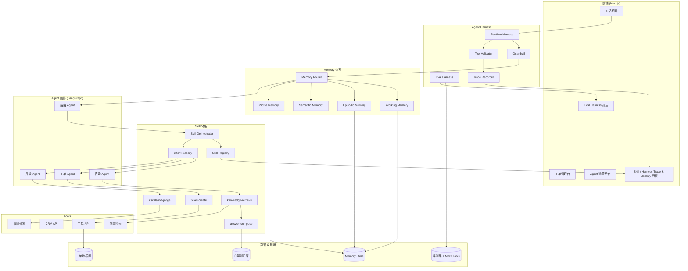

# AIProductManager 项目计划

> **目标**：用一套可演示、可度量、可讲述的 B2B Agent 作品集，**100% 覆盖** JD 全部职责与必备条件，并在 **Skill 编排体系**、**Agent Harness（执行/评测双 Harness）**、**分层 Memory 体系**、可观测性、2B 确定性设计五个维度**显著超出**岗位要求。

---

## 一、项目定位

### 1.1 项目名称

**智服通 AgentOps** — 企业智能客服与工单 Agent 运营中台

### 1.2 一句话价值

把客户模糊的「我想搞点 AI 客服」，落地为**可嵌入工单 / CRM / 知识库**的多 Agent 业务闭环；用 **Skill 体系定义能力边界与编排逻辑**，用 **Harness 保证可复现、可回归**，用 **Memory 保证跨会话连续服务**，再用 **自动化评测 + Bad Case 归因 + 业务 ROI** 证明效果，而不只是聊天 Demo。

### 1.3 为什么选这个场景

| JD 提及场景 | 本项目覆盖方式 |
|-------------|----------------|
| 客服 | 核心对话入口 + 意图路由 |
| 工单 | 工单创建 / 流转 / 升级状态机 |
| 知识管理 | RAG 知识库 + 检索失效诊断 |
| 运营后台 | Agent 监控、评测、Bad Case 管理 |
| 销售 / 风控 / 研发 | 扩展 Skill 预留接口（演示多场景切换） |

一个项目覆盖 JD 中 **5/6** 业务域，面试时可横向展开，不必堆多个零散 Demo。

---

## 二、JD 100% 对标矩阵

| JD 要求 | 本项目交付物 | 覆盖度 |
|---------|-------------|--------|
| Agent 角色 / Skill / Workflow / 工具 / 知识依赖 / 评测指标拆解 | `docs/01-agent-architecture.md` + `docs/13-skill-design.md` + 架构图 | ✅ 100% + **超出** |
| 独立 Prompt / Skill / Workflow 编排并对效果负责 | Skill Registry + LangGraph Workflow + Prompt 版本库 | ✅ 100% + **超出** |
| 讲清 Skill 边界与编排 rationale | Skill Manifest + 边界矩阵 + Skill 级独立评测 | ✅ 100% + **超出** |
| RAG / 召回 / 长上下文 / Tool Call 失效判断 | `docs/05-failure-mode-playbook.md` + Harness 归因面板 | ✅ 100% + **超出** |
| 场景化评测集 + 自动化评测 | Eval Harness + 120 条评测集 + CI 门禁 | ✅ 100% + **超出** |
| 长上下文 / 多轮对话连续性 | 分层 Memory 体系 + 跨会话 Demo | ✅ 100% + **超出** |
| Agent 效果负责到底 | Runtime Harness（Guardrail / Retry / Tool 校验） | ✅ 100% + **超出** |
| 嵌入工单 / CRM / ERP / 知识库 / 运营后台 | 模拟 2B 系统集成 + 端到端闭环 Demo | ✅ 100% |
| PRD / 流程图 / 数据流 / 权限 / 异常路径 | 完整 PRD 套件（6 份文档） | ✅ 100% |
| LLM 灵活性 vs 2B 确定性平衡 | `docs/06-design-decision-records.md`（≥5 条 ADR） | ✅ 100% |
| Vibe Coding 可点击 Demo | Next.js 全栈 + 在线部署 + 录屏 | ✅ 100% |
| 原型驱动客户共创 | `docs/07-co-creation-workshop-kit.md` | ✅ 100% |
| 需求挖掘 + 多角色沟通 | `docs/08-requirement-discovery-case.md` | ✅ 100% |
| Bad Case → 归因 → 修复 → 业务指标 | 运营看板 + 量化报告模板 | ✅ 100% |

---

## 三、八大亮点（超出 JD 要求）

> 亮点排序按**技术深度 × 面试差异化**排列。**Skill / Harness / Memory** 是本项目与「普通聊天 Demo」的本质分界线。

---

### 亮点 1：Agent Harness — 执行 Harness + 评测 Harness 双引擎

**核心观点**：Agent 产品化的关键不是 Prompt 写得多好，而是有没有 **Harness** 让 Agent 行为**可复现、可回归、可审计**。本项目自研轻量 Harness 层，而非仅依赖 Dify 黑盒编排。

#### 1.1 Runtime Harness（生产执行层）

包裹每一次 Agent 调用的统一运行时：

```
用户输入
  ↓
[Input Guardrail]  ── 敏感词 / PII 脱敏 / 注入攻击拦截
  ↓
[Memory Injector]  ── 按 Skill Manifest.memory_deps 注入上下文
  ↓
[Skill Orchestrator] ── 按 Skill 有向图调度 Skill 执行
  ↓
[Skill Executor]   ── 执行单个 Skill（Prompt + Tool + Fallback）
  ↓
[Tool Validator]   ── JSON Schema 校验 + 参数补全 + 失败重试（最多 3 次）
  ↓
[Output Guardrail] ── 幻觉检测 / 来源引用强制 / 合规模板兜底
  ↓
[Trace Recorder]   ── 全链路写入 Trace Store
  ↓
用户输出
```

| Harness 模块 | 解决的真实问题 | 2B 价值 |
|-------------|---------------|---------|
| Input/Output Guardrail | Prompt 注入、敏感信息泄露 | 合规审计 |
| Tool Validator | Tool Call 参数幻觉、格式错误 | 工单字段完整率 |
| Retry & Fallback | LLM 超时、Tool 5xx | SLA 保障 |
| Step Limiter | Agent 无限循环 | 成本可控 |
| Version Pinning | Prompt 变更导致行为漂移 | 可回归 |

#### 1.2 Eval Harness（评测回归层）

独立于生产环境的**确定性评测沙箱**：

```
eval-harness/
├── scenarios/           # 120+ 场景定义（YAML）
├── mock_tools/          # Mock 工单/CRM API，消除外部依赖
├── memory_fixtures/     # 预置 Memory 状态（测跨会话场景）
├── assertions/          # 断言引擎：意图/Tool/回复/Memory 四维断言
├── replay/              # Trace 回放：同一输入复现历史行为
└── report/              # 评测报告生成 + CI 门禁
```

**断言引擎五维覆盖**（普通评测只测回复文本，本项目测全链路）：

| 断言类型 | 示例 | 对应 JD |
|---------|------|---------|
| **Skill Assertion** | 输入「查工单进度」→ invoke `ticket-query`，禁止 invoke `ticket-create` | Skill 边界 |
| Intent Assertion | 输入「我要退款」→ 意图 = 退款 | Agent 设计 |
| Tool Assertion | 必须调用 `ticket_create` 且 `priority=high` | Tool Call |
| Response Assertion | 回复必须包含订单号 + 引用来源 | RAG / Prompt |
| Memory Assertion | 第 3 轮对话应引用第 1 轮提到的工单号 | 长上下文 |

- GitHub Actions：**Skill / Prompt / Workflow / Memory 策略任一变更 → 自动跑 Eval Harness**
- 通过率 < 85% 阻断合并；支持 **Trace Replay** 对比两次变更的行为 diff
- 面试话术：「我不只搭 Agent，我还做了 Harness 让 Agent 成为可工程化的 2B 产品」

---

### 亮点 2：分层 Memory 体系 — 不是「塞满 Context Window」

**核心观点**：2B 客服 Agent 的核心体验是**跨会话连续性**——用户昨天报修的工单，今天再来不应重复描述。本项目设计 **4 层 Memory + Memory Router**，而非简单堆对话历史。

#### 2.1 四层 Memory 架构

```
┌─────────────────────────────────────────────────────────┐
│                    Memory Router                         │
│   根据意图 + 用户 ID + 会话阶段，决定注入哪些 Memory      │
└──────────┬──────────┬──────────┬──────────┬─────────────┘
           ↓          ↓          ↓          ↓
   ┌──────────┐ ┌──────────┐ ┌──────────┐ ┌──────────┐
   │ Working  │ │ Episodic │ │ Semantic │ │ Profile  │
   │ Memory   │ │ Memory   │ │ Memory   │ │ Memory   │
   │ 工作记忆  │ │  episodic│ │ 语义记忆  │ │ 画像记忆  │
   └──────────┘ └──────────┘ └──────────┘ └──────────┘
```

| 层级 | 存储内容 | 生命周期 | 典型用途 |
|------|---------|---------|---------|
| **Working Memory** | 当前会话消息 + 中间推理步骤 | 会话级，关闭即归档 | 多轮澄清、上下文指代消解（「那个订单」） |
| **Episodic Memory** | 历史会话摘要、已结工单、交互时间线 | 用户级，90 天 TTL | 「您上周反馈的 #T-2847 已修复，请问还有问题吗？」 |
| **Semantic Memory** | 企业知识库（FAQ / SOP / 产品手册） | 持久，版本化管理 | RAG 检索，知识更新可回溯 |
| **Profile Memory** | 客户等级、合同套餐、偏好渠道、历史满意度 | 用户级，持久 | VIP 客户自动升级优先级；偏好邮件而非电话 |

#### 2.2 Memory 生命周期管理（2B 必修）

| 策略 | 规则 | 为什么重要 |
|------|------|-----------|
| **Write Policy** | 仅 Working → Episodic 写入需经摘要 + 去 PII | 2B 合规，不能原文存敏感信息 |
| **Summarize & Compress** | Working Memory 超 8 轮 → 自动摘要压缩 | 解决 JD「长上下文」失效 |
| **Forget Policy** | Episodic 90 天过期；用户可请求删除 | GDPR / 个保法 |
| **Conflict Resolution** | Profile 与 Episodic 冲突 → Profile 优先 | 避免旧会话覆盖新套餐 |

#### 2.3 Memory Router — 注入策略

不是每次全量注入，而是**按需路由**：

```
用户：「上次那个退款怎么样了？」
  ↓
Memory Router 分析：
  ├── 指代消解 → 需要 Episodic Memory（最近 30 天退款相关会话）
  ├── 不需要 Semantic Memory（非知识问答）
  └── 需要 Profile Memory（确认用户身份 + VIP 等级）
  ↓
注入 Token 预算：Episodic 800 + Profile 200 + Working 1500 = 2500 tokens
```

#### 2.4 可演示的 Memory 场景（录屏必拍）

| 场景 | 演示效果 | 评测断言 |
|------|---------|---------|
| **跨会话续接** | 昨天创建工单 #T-001，今天问「我的工单进度」→ 准确引用 | Memory Assertion |
| **指代消解** | 「那个订单」→ 关联 Working Memory 第 2 轮提到的订单号 | Working Memory |
| **VIP 识别** | Profile Memory 标记 VIP → 自动高优先级 + 专属话术 | Profile Memory |
| **长对话压缩** | 15 轮对话后 Working Memory 自动摘要，不丢关键信息 | Summarize 策略 |
| **Memory 失效诊断** | 故意不注入 Episodic → 用户重复描述 → Harness 归因到 Memory 层 | 五层归因 |

- 配套文档：`docs/11-memory-design.md`（Memory 架构 + Write/Forget Policy + Router 规则）
- Eval Harness 专设 **Memory Fixture 场景 20 条**，覆盖跨会话 / 指代 / 冲突 / 过期

---

### 亮点 3：Skill 编排体系 — 能力可组合、边界可度量

**核心观点**：JD 要求「讲清楚 Skill 边界在哪里、Workflow 为什么这么编排」—— 本项目将 **Skill** 定义为 Agent 与 Tool 之间的**最小可独立评测能力单元**，通过 **Skill Registry + Skill Orchestrator** 实现能力复用与边界治理，而非把逻辑散落在 Prompt 里。

#### 3.1 三层能力模型

```
Agent（角色层）  ── 负责决策「做什么、何时做、交给谁」
    ↓ 拥有
Skill（能力层）  ── 负责「怎么做」一个原子业务能力，可独立评测
    ↓ 调用
Tool（工具层）  ── 负责与外部系统交互（API / DB / 检索引擎）
```

| 层级 | 职责 | 示例 | 不该做的事 |
|------|------|------|-----------|
| **Agent** | 路由、多 Skill 编排、异常升级 | 路由 Agent、工单 Agent | 不直接调 API |
| **Skill** | 单一业务能力，输入输出契约明确 | `ticket-create-skill` | 不创建工单又查进度 |
| **Tool** | 原子 API 调用 | `ticket_api.create()` | 不做业务判断 |

#### 3.2 Skill Registry — 能力目录

每个 Skill 注册为一份 **Skill Manifest**（YAML），可版本化、可独立评测：

```yaml
# skills/manifests/ticket-create-skill.yaml
id: ticket-create-skill
version: 1.2.0
name: 工单创建
description: 从对话中提取工单字段并创建工单，不负责查询进度
agent: ticket-agent
boundary:
  does: [提取字段, 校验完整性, 调用创建 API, 返回工单号]
  does_not: [查询工单状态, 修改工单, 关闭工单]
inputs:
  - conversation_context   # 来自 Working Memory
  - user_profile           # 来自 Profile Memory
outputs:
  - ticket_id
  - ticket_summary
tools: [ticket_api.create, crm_api.get_customer]
memory_deps: [working, profile]
prompt_template: prompts/skills/ticket-create.md
eval_suite: evaluation/skills/ticket-create/   # Skill 级评测集
fallback: rule-engine.ticket-template          # Skill 级降级
```

**本项目注册 12 个 Skill**（覆盖 JD 客服 / 工单 / 知识管理场景）：

| Skill ID | 归属 Agent | 边界（does_not） | 独立评测集 |
|----------|-----------|-----------------|-----------|
| `intent-classify` | 路由 Agent | 不生成回复、不调 Tool | 25 条 |
| `agent-route` | 路由 Agent | 不执行业务 Skill | 15 条 |
| `knowledge-retrieve` | 咨询 Agent | 不生成最终回复 | 25 条 |
| `answer-compose` | 咨询 Agent | 不检索、不建单 | 20 条 |
| `ticket-create` | 工单 Agent | 不查询/修改/关闭工单 | 20 条 |
| `ticket-query` | 工单 Agent | 不创建/修改工单 | 15 条 |
| `ticket-update` | 工单 Agent | 不创建工单 | 10 条 |
| `escalation-judge` | 升级 Agent | 不直接转人工（仅判断） | 15 条 |
| `human-handoff` | 升级 Agent | 不做业务处理 | 10 条 |
| `sentiment-analyze` | 投诉 Agent | 不决定升级策略 | 10 条 |
| `crm-lookup` | 共用 | 不修改 CRM 数据 | 10 条 |
| `compliance-check` | Harness 共用 | 不做业务回复 | 10 条 |

#### 3.3 Skill Orchestrator — 编排逻辑

Workflow 不是「Agent 里写一大段 Prompt」，而是 **Skill 有向图**：

```
[intent-classify] → 咨询意图?
    ├── Yes → [knowledge-retrieve] → [answer-compose] → 结束
    ├── 工单意图 → [ticket-create] 或 [ticket-query]（由字段完整度决定）
    └── 投诉意图 → [sentiment-analyze] → [escalation-judge]
                        ├── 需升级 → [human-handoff]
                        └── 可处理 → [answer-compose]
```

**编排决策 ADR 示例**（面试必讲）：

| 决策 | 为什么这么编排 |
|------|---------------|
| 检索与生成拆成两个 Skill | 检索失败可单独归因、单独评测，不污染生成 Skill |
| `escalation-judge` 与 `human-handoff` 分离 | 判断用 LLM，执行用规则（2B 确定性） |
| `intent-classify` 独立于各 Agent | 路由变更不影响业务 Skill 版本 |

#### 3.4 Skill 级评测 — Eval Harness 第五维断言

| 断言类型 | 示例 |
|---------|------|
| **Skill Invocation Assertion** | 输入「我要退款」→ 必须 invoke `ticket-create`，不得 invoke `ticket-query` |
| **Skill Boundary Assertion** | `knowledge-retrieve` 输出必须含 source_refs，不得含 user-facing 回复 |
| **Skill Fallback Assertion** | `ticket-create` 字段缺失 → 触发 `rule-engine.ticket-template` 追问 |
| **Skill Version Assertion** | Skill v1.2 → v1.3 变更后，Regression 集通过率 ≥ 90% |

- 每个 Skill **独立评测集 + 独立通过率**，Bad Case 可精确归因到单个 Skill
- 运营后台 **Skill 面板**：调用频次、成功率、平均耗时、版本分布

#### 3.5 可演示的 Skill 场景（录屏必拍）

| 场景 | 演示效果 | 证明什么 |
|------|---------|---------|
| **Skill 边界** | 用户问进度 → 只触发 `ticket-query`，不触发 `ticket-create` | Skill 边界清晰 |
| **Skill 降级** | 字段不全 → `ticket-create` 降级为模板追问，不 hallucinate 工单 | 2B 确定性 |
| **Skill 复用** | 咨询 Agent 和投诉 Agent 共用 `crm-lookup` | 能力可组合 |
| **Skill 归因** | Bad Case 定位到 `knowledge-retrieve` 召回失败，而非整个 Agent | 效果负责到底 |

- 配套文档：`docs/13-skill-design.md`（Skill 架构 + Registry + 边界矩阵 + 编排 ADR）
- 代码目录：`skills/manifests/` + `skills/orchestrator/` + `skills/runtime/`

---

### 亮点 4：Multi-Agent 编排 + Skill + Harness 统一调度

```
用户 ──→ [路由 Agent]
              │ intent-classify Skill → agent-route Skill
              ├──→ 咨询 Agent ──→ knowledge-retrieve → answer-compose
              ├──→ 工单 Agent ──→ ticket-create / ticket-query
              └──→ 投诉 Agent ──→ sentiment-analyze → escalation-judge → human-handoff
                    ↑
              [Runtime Harness 包裹每个 Skill 调用]
              [Memory Router 在每个 Skill 入口注入依赖 Memory]
              [Skill Registry 提供 Manifest + 版本 + Fallback]
```

- **3 个专业 Agent + 1 个路由 Agent**，挂载 **12 个 Skill**，每个 Skill 边界清晰、可独立评测
- Agent 只做「决策与编排」，Skill 做「执行」，Tool 做「调用」—— 三层职责不混淆
- 面试可直接讲：**Agent / Skill / Tool 为什么这么分、Skill 边界在哪、Workflow 为什么这么编排**

---

### 亮点 5：Agent 可观测性面板 — Skill + Harness Trace 可视化

JD 要求「定位问题出在哪一层」—— Harness 产生的 Trace 直接驱动运营面板：

| 追踪维度 | 展示内容 |
|----------|----------|
| **Skill 调用链** | Agent → Skill → Tool 三级链路，每个 Skill 版本 / 耗时 / 成功率 |
| Harness Trace | Guardrail → Memory Inject → Skill → Tool → Guardrail 全链路 |
| Memory 注入视图 | 本轮各 Skill 注入了哪些 Memory 层、Token 占用 |
| 置信度 | 意图识别 / RAG 命中 / Skill 输出置信分 |
| **七层归因** | 模型 / Prompt / **Skill** / 知识 / 检索 / 流程 / Memory |
| 耗时分解 | LLM / Skill 编排 / Memory 检索 / Tool / Guardrail |
| Replay Diff | 两次 Skill / Prompt 版本的行为差异对比 |
| **Skill 健康度** | 各 Skill 成功率、Fallback 触发率、版本分布 |

> 七层归因在 JD 五层基础上增加 **Skill** 与 **Memory**，体现 PM 对全链路的掌控力。

---

### 亮点 6：Eval Harness + 120 条分层评测集 + CI 门禁

| 层级 | 数量 | 覆盖 | Harness 断言类型 |
|------|------|------|-----------------|
| L1 Skill 路由 | 25 条 | Skill Invocation + Boundary | **Skill Assertion** |
| L2 RAG 召回 | 25 条 | knowledge-retrieve Skill | Response + Source Assertion |
| L3 Tool 调用 | 25 条 | ticket-create / crm-lookup 等 | Tool Assertion |
| L4 Memory | 20 条 | 跨会话 / 指代 / VIP / 摘要 | Memory Assertion |
| L5 端到端 | 25 条 | 多 Skill 编排 / 升级 / 降级 | 五维组合断言 |

- Eval Harness 与生产 Runtime Harness **共享 Tool Validator 和 Guardrail 逻辑**，评测结果 ≡ 生产行为
- GitHub Actions：**Skill / Prompt / Workflow / Memory 策略任一变更 → 自动跑 Eval Harness**
- 通过率 < 85% 阻断合并；Skill 级 Regression 独立报告

---

### 亮点 7：2B 确定性设计 — 「LLM 禁区地图」+ Skill 降级策略

用 ADR（Architecture Decision Record）明确每一环节的决策：

| 环节 | 决策 | 承载层 |
|------|------|--------|
| 工单状态流转 | **规则引擎** | Tool 层，Skill 不得绕过 |
| 退款金额计算 | **规则引擎** | 独立 `compliance-check` Skill |
| 意图识别 | **LLM + 置信度阈值** | `intent-classify` Skill |
| 知识问答 | **RAG + LLM** | `knowledge-retrieve` + `answer-compose` |
| Skill 降级 | **Manifest.fallback** | 每个 Skill 声明降级路径 |
| Memory 写入 | **摘要 + 审核开关** | Memory Policy 层 |
| 敏感词 / 合规 | **Harness Guardrail** | 所有 Skill 调用前拦截 |

---

### 亮点 8：「从模糊到落地」完整叙事包

不只交 Demo，交**可复用的 PM 方法论**：

```
客户原话：「我们想搞点 AI，提升客服效率」
    ↓ 5 Whys + 干系人地图
真实痛点：工单重复录入 40% 工时；老用户重复描述；Skill 边界不清导致 Agent 行为不可预测
    ↓ Trade-off 工作坊
方案取舍：Skill 定义能力边界 + Harness 保证确定性 + Memory 保证连续性
    ↓ 48h Vibe Coding
可点击原型 → 现场共创 → Eval Harness 回归 → 上线
    ↓ 30 天
解决率 72% → 81%，重复描述率 -35%，人均产能 +23%
```

- 配套：`docs/08-requirement-discovery-case.md`（需求挖掘）
- 配套：`docs/07-co-creation-workshop-kit.md`（30 分钟共创脚本）
- 配套：`docs/09-roi-report-template.md`（业务价值量化模板）

---

## 四、系统架构



---

## 五、交付物清单

### 5.1 文档体系（2B PRD 能力证明）

```
docs/
├── 01-agent-architecture.md       # Agent 拆解：角色 / Skill / Workflow / 工具 / 知识 / 指标
├── 02-PRD-智服通AgentOps.md        # 主 PRD（功能 / 非功能 / 里程碑 / 风险）
├── 03-workflow-and-state-machine.md # 业务流程图 + 工单状态机
├── 04-permission-and-data-flow.md  # RBAC 权限矩阵 + 数据流图
├── 05-failure-mode-playbook.md     # RAG/召回/Tool/长上下文 失效诊断手册
├── 06-design-decision-records.md   # LLM vs 规则 ADR（≥5 条）
├── 07-co-creation-workshop-kit.md  # 客户共创工作坊脚本 + 议程
├── 08-requirement-discovery-case.md # 从「想搞 AI」到明确方案的完整案例
├── 09-roi-report-template.md       # 业务价值量化报告模板
├── 10-prompt-registry.md           # Prompt 版本管理与变更记录
├── 11-memory-design.md             # 四层 Memory 架构 + Router + Write/Forget Policy
├── 12-harness-design.md            # Runtime Harness + Eval Harness 设计文档
└── 13-skill-design.md              # Skill Registry + 边界矩阵 + Orchestrator + 编排 ADR
```

### 5.2 代码与 Demo

```
AIProductManager/
├── frontend/                # Next.js 对话 UI + 管理后台 + Skill/Harness/Memory 面板
├── backend/                 # FastAPI：Agent 代理 / Skill API / 工单 API / Memory API
├── skills/                  # ★ Skill 体系
│   ├── manifests/           # 12 个 Skill Manifest（YAML）
│   ├── orchestrator/        # Skill 有向图编排 + 路由逻辑
│   ├── runtime/             # Skill 执行器 + Fallback + 版本管理
│   └── prompts/             # Skill 级 Prompt 模板
├── harness/                 # ★ Runtime Harness + Eval Harness 核心
│   ├── runtime/             # Guardrail / Tool Validator / Trace / Retry
│   ├── eval/                # 场景定义 / Mock Tools / 断言引擎 / Replay
│   └── shared/              # Harness 与 Eval 共享的逻辑
├── memory/                  # ★ Memory 体系
│   ├── router/              # Memory Router：注入策略
│   ├── stores/              # Working / Episodic / Profile Store 实现
│   └── policies/            # Write / Summarize / Forget Policy
├── agent/                   # LangGraph Workflow + Prompt 模板
├── knowledge-base/          # 示例 FAQ / SOP / 产品手册（50+ 文档）
├── evaluation/              # 120 条评测集 + Skill/Memory Fixture + 报告
│   └── skills/              # 各 Skill 独立 Regression 集
├── scripts/                 # 部署 / 数据初始化 / CI 评测
├── docs/                    # 上述 13 份文档
├── asserts/                 # 架构图 / 截图 / 录屏
├── JD.md
├── PROJECT_PLAN.md          # 本文件
└── README.md                # 5 分钟读懂项目 + Demo 链接
```

### 5.3 对外展示三件套

| 形式 | 内容 | 用途 |
|------|------|------|
| **GitHub 仓库** | 完整代码 + 文档 + 评测集 | JD 要求「至少一个 Demo」 |
| **在线 Demo** | Vercel 部署，含对话 + 后台 + 评测面板 | 面试官自助体验 |
| **5 分钟录屏** | 用户旅程 + Skill 路由 + 运营后台 + Bad Case 归因 | 快速建立信任 |

---

## 六、执行计划（4 周冲刺）

> 详细任务拆解、测试分层、CI 流水线见 **[DEV_TEST_PLAN.md](./DEV_TEST_PLAN.md)**。

### Week 1：设计先行 — 证明「能设计，不是只会写代码」

| 天 | 任务 | 产出 |
|----|------|------|
| D1 | 编写需求挖掘案例（模拟真实客户） | `08-requirement-discovery-case.md` |
| D2 | Agent 架构 + **Skill 体系** + Harness + Memory | `01` + `13-skill-design` + `12-harness` + `11-memory` |
| D3 | 主 PRD + 流程图 + 状态机 | `02-PRD` + `03-workflow` |
| D4 | 权限模型 + 数据流 + 异常路径 | `04-permission-and-data-flow.md` |
| D5 | LLM vs 规则 ADR + 失效诊断手册 | `06-ADR` + `05-failure-mode-playbook` |

**Week 1 验收**：文档齐全，面试官仅看文档即可判断 2B PM 能力。

### Week 2：Vibe Coding 核心 Demo — 证明「跑得起来」

| 天 | 任务 | 工具 |
|----|------|------|
| D1 | 对话 UI + **Memory 注入可视化**（展示本轮注入了哪些层） | Cursor + v0 |
| D2 | **Runtime Harness 骨架**（Guardrail + Tool Validator + Trace） | Cursor |
| D3 | **Skill Registry**（12 个 Manifest）+ **Skill Orchestrator** 骨架 | `skills/` |
| D4 | Agent Workflow + Skill 挂载 + RAG 接入 | LangGraph |
| D5 | 前后端联调 + **Skill 边界 Demo** + 跨会话 Memory Demo | Cursor |

**Week 2 验收**：12 个 Skill 可独立调用；Skill 边界 Demo 可演示；跨会话 Memory 续接可演示；Harness Trace 含 Skill 链路。

### Week 3：Eval Harness + Skill/Memory 评测 + 运营面板

| 天 | 任务 | 产出 |
|----|------|------|
| D1 | **Eval Harness**（五维断言 + Mock Tools + Scenario YAML） | `harness/eval/` |
| D2 | **Skill 健康度面板** + Harness Trace + Memory 注入视图 + 七层归因 | 运营后台 |
| D3 | 120 条评测集（含 Skill 路由 25 条 + Memory 20 条） | `evaluation/test_cases/` |
| D4 | Eval Harness 全量跑测 + 报告 + **Trace Replay Diff** | `harness/eval/report/` |
| D5 | GitHub Actions CI 门禁（Harness / Memory / Prompt 变更触发） | `.github/workflows/eval.yml` |

**Week 3 验收**：Eval Harness 五维断言全绿；各 Skill 独立通过率 ≥ 85%；Memory 场景 ≥ 90%；Skill/Prompt 变更可 Replay Diff。

### Week 4：作品集打包 — 证明「能讲清楚、能交付价值」

| 天 | 任务 | 产出 |
|----|------|------|
| D1 | 共创工作坊 Kit + ROI 报告模板 | `07` + `09` |
| D2 | 部署上线（Vercel + 后端） | 在线 Demo URL |
| D3 | 5 分钟录屏 + README 完善 | `asserts/demo.mp4` |
| D4 | 模拟 Bad Case 复盘（含 Memory 失效场景）+ Harness 修复迭代 | Before/After Replay Diff |
| D5 | 面试叙事排练：15 分钟 Standard Pitch | Pitch 大纲 |

**Week 4 验收**：GitHub + 在线 Demo + 录屏 + 完整文档，可直接投递。

---

## 七、核心业务指标（Demo 中可展示）

| 指标 | 目标值 | 展示方式 |
|------|--------|----------|
| 一次解决率 | ≥ 75% | Eval Harness 报告 |
| 平均对话轮次 | ≤ 4 轮 | Eval Harness 报告 |
| 转人工率 | ≤ 15% | 运营看板 |
| **Skill 路由准确率** | ≥ 90% | Skill Assertion 报告 |
| **单 Skill 独立通过率** | ≥ 85%（每个 Skill） | Skill 级 Regression |
| RAG 命中率 | ≥ 80% | `knowledge-retrieve` Skill 归因 |
| **跨会话 Memory 命中率** | ≥ 85% | Memory Assertion 报告 |
| **重复描述率**（用户重复说同一问题） | ≤ 10% | Episodic Memory 效果 |
| 工单字段完整率 | ≥ 95% | Tool Validator 统计 |
| Harness Guardrail 拦截率 | 可度量 | Trace 面板 |
| 平均响应时间 | ≤ 3s | Trace 耗时分解 |
| Prompt/Skill/Memory 变更回归 | 自动化 | Eval Harness CI 门禁 |

---

## 八、15 分钟 Standard Pitch（面试叙事结构）

> 用于面试现场，证明四项必备条件一气呵成。

| 分钟 | 内容 | 对应 JD |
|------|------|---------|
| 0–2 | 客户原话 → 5 Whys → 痛点含 Skill 边界不清 + 无 Memory | 需求挖掘 |
| 2–5 | **Agent / Skill / Tool 三层模型** + 12 Skill 边界矩阵 + 编排 ADR | **Skill 设计（JD 核心）** |
| 5–7 | **四层 Memory** + Router + 跨会话 Demo | 长上下文 |
| 7–9 | **Runtime Harness** + Skill 降级 + LLM 禁区 + 七层归因 | 效果负责 |
| 9–12 | Live Demo：Skill 路由 → 跨会话续接 → 建单 → Eval Harness Skill 报告 | Vibe Coding + 评测 |
| 12–15 | ROI（含重复描述率下降）+ Q&A | 业务结果交付 |

---

## 九、风险与应对

| 风险 | 应对 |
|------|------|
| Skill 边界模糊 / 行为不可预测 | Skill Registry + Manifest 边界声明 + Skill 级独立评测 |
| Skill 版本变更引入回归 | 每个 Skill 独立 Regression 集 + Eval Harness CI |
| Agent 效果不稳定 | Runtime Harness：Guardrail + Retry + Tool Validator + Skill Fallback |
| Memory 上下文爆炸 | Working Memory 自动摘要 + Memory Router Token 预算 |
| 跨会话 Memory 不准 | Episodic 写入摘要 + Memory Assertion 回归 |
| Eval 与生产行为不一致 | Eval Harness 与 Runtime Harness 共享 Guardrail / Validator 逻辑 |
| 4 周时间不够 | Week 2 结束即有可演示 MVP；Week 3/4 为加分项 |
| 无真实客户 | 用「某 SaaS 企业客服团队」虚构但合理的 B2B 案例，数据自洽 |
| 部署成本 | 前端 Vercel 免费层 + 后端 Railway 免费层 + 本地 Memory Store |

---

## 十、JD 自检清单（投递前逐项打勾）

### 必备条件

- [ ] 能白板画出 **Agent / Skill / Tool 三层模型**并讲清 12 个 Skill 边界
- [ ] 有完整 PRD（含状态机 / 权限 / 异常路径）
- [ ] GitHub 可访问 + 在线 Demo 可点击 + 录屏可播放
- [ ] 需求挖掘案例可讲述（含 Trade-off 决策过程）
- [ ] 共创工作坊脚本可现场模拟

### 职责覆盖

- [ ] **Skill Registry** 12 个 Manifest + 编排 ADR + Skill 级版本管理
- [ ] RAG / Tool / Memory / **Skill 路由** 失效各有 Harness 诊断路径
- [ ] Eval Harness 120 条评测集 + **五维断言（含 Skill）** + CI 门禁
- [ ] 嵌入工单 + 知识库 + 运营后台 + **Skill Registry + Memory Store** 端到端闭环
- [ ] Bad Case → **七层归因**（含 Skill + Memory）→ 修复 → 指标提升

### 超出项（差异化）

- [ ] **Skill Registry + Orchestrator** + 12 Skill 独立评测 + 健康度面板
- [ ] **四层 Memory** + Memory Router + 跨会话续接 Demo
- [ ] **Runtime Harness** 可演示（Guardrail / Tool Validator / Trace / Retry）
- [ ] **Eval Harness** 五维断言 + Skill Replay Diff + CI 门禁
- [ ] Memory 注入可视化 + **七层归因**（含 Skill + Memory 层）
- [ ] LLM 禁区地图 + ADR 决策记录
- [ ] Before/After Harness 修复 + Replay Diff 对比
- [ ] ROI 量化报告（含重复描述率指标）
- [ ] 15 分钟 Standard Pitch 可流畅讲述

---

## 十一、立即启动（Day 0）

按以下顺序开始，**今天即可动手**：

1. 创建 `docs/`、`skills/`、`harness/`、`memory/` 目录结构
2. 撰写 `13-skill-design.md`（Skill 架构 — JD 核心差异化）
3. 撰写 `12-harness-design.md` + `11-memory-design.md`
4. 初始化 `skills/manifests/`（先写 3 个核心 Skill Manifest）
5. 撰写 `08-requirement-discovery-case.md` + 初始化 `frontend/` 对话 UI

> **核心原则**：文档与代码并行，不是「先写完文档再写代码」。Week 1 每天下午用 Cursor 把上午的设计变成可运行的片段 —— 这正是 JD 所说的 Vibe Coding 交付方式。
