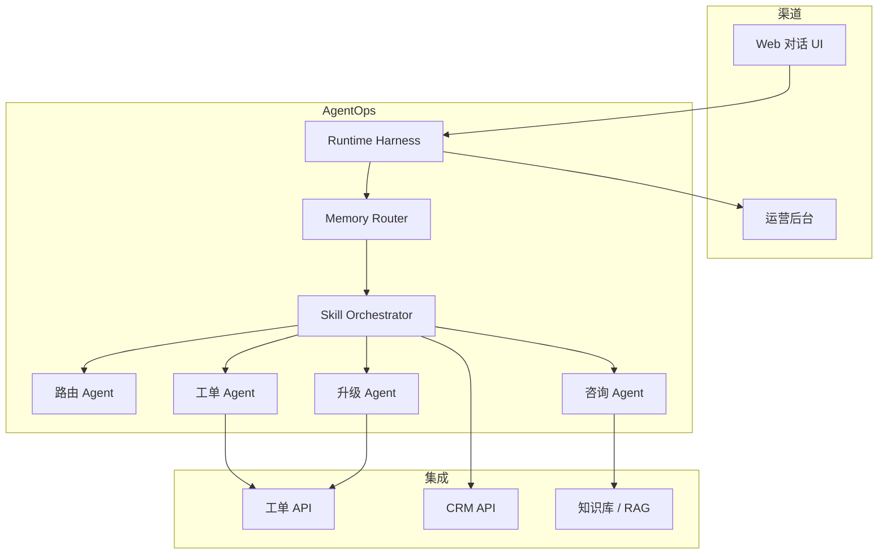
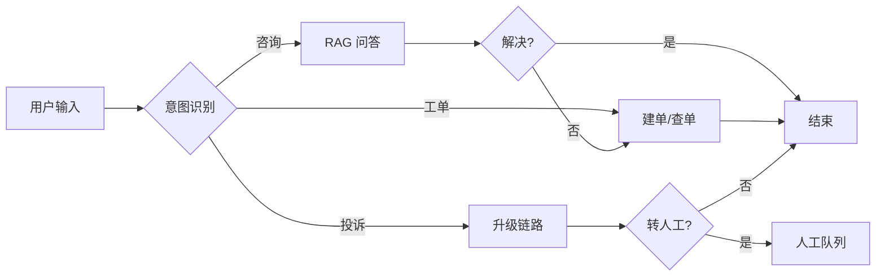

# PRD：智服通 AgentOps

| 项 | 内容 |
|----|------|
| **文档编号** | PRD-AOPS-001 |
| **版本** | v1.1 |
| **状态** | 评审中 |
| **作者** | AgentOps PM |
| **评审人** | 李经理（业务）、王工（IT）、研发负责人、测试负责人 |
| **最后更新** | 2026-06-01 |
| **关联文档** | [交付索引](./DELIVERY-INDEX.md) · [需求挖掘](./08-requirement-discovery-case.md) · [API 规格](./15-api-specification.md) · [RTM](./16-fr-traceability-matrix.md) · [UAT](./17-uat-acceptance-plan.md) · [部署运维](./18-deployment-operations.md) · [安全合规](./19-security-compliance.md) · [界面说明](./20-ui-wireframes.md) |

### 变更记录

| 版本 | 日期 | 作者 | 变更说明 |
|------|------|------|----------|
| v0.1 | 2026-06-01 | PM | 冲刺骨架版（功能清单） |
| v1.0 | 2026-06-01 | PM | 完整 2B PRD：用户故事、集成、状态机、权限、异常、评测 |
| v1.1 | 2026-06-01 | PM | 面向真实客户交付：关联 API/UAT/运维/安全/RTM 文档包 |

---

## 1. 摘要（Executive Summary）

**智服通 AgentOps** 是嵌入企业既有 **工单 / CRM / 知识库 / 运营后台** 的智能客服 Agent 运营中台。产品通过 **Skill 编排 + Runtime/Eval 双 Harness + 四层 Memory**，在保障 2B 确定性的前提下，实现可演示、可度量、可回归的 Agent 业务闭环。

**MVP 目标（30 天）**：

- 一次解决率从 45% → **≥75%**
- 坐席人均日处理工单从 28 → **≥35 单**
- 老用户重复描述率从 32% → **≤10%**
- Prompt/Skill 变更具备 **CI 自动化回归**（120 条评测集，通过率 ≥85%）

**本期不做**：销售 Agent、风控 Agent、替换现有工单系统、多租户 SaaS 化。

---

## 2. 背景与问题陈述

### 2.1 业务背景

某 B2B SaaS 企业（500 人、客服 35 人、日工单 800+）。客户原话：「想搞点 AI 提升客服效率。」经五 Whys 挖掘，真实问题不是「缺聊天框」，而是：

| 痛点 ID | 描述 | 现状 | 业务影响 |
|---------|------|------|----------|
| P1 | 工单重复录入 | 占工时 40% | 人均 28 单/日 |
| P2 | 知识检索失效 | 命中率 <55% | FAQ 本应自助 |
| P3 | 无跨会话 Memory | 重复描述率 32% | NPS -8 |
| P4 | Agent 行为不可预测 | 试点解决率 <45% | 业务拒绝上线 |
| P5 | 无效果度量 | 迭代靠猜 | 无法对 ROI 负责 |

> 详见 [08-requirement-discovery-case.md](./08-requirement-discovery-case.md)

### 2.2 产品机会

用 **「Skill 定义边界 + Harness 保确定性 + Memory 保连续性 + Eval 保回归」** 替代「单 Prompt 聊天 Demo」，满足 2B 客户对合规、可审计、可嵌入的要求。

### 2.3 约束条件

| 约束 | 来源 | 产品影响 |
|------|------|----------|
| 数据不出 VPC | 王工 / 合规 | 私有化或国内云部署 |
| 工单系统不可替换 | 已用 5 年自研 | API 嵌入，不做系统迁移 |
| 退款/状态不可交 LLM | 财务合规 | 规则引擎兜底 |
| Q3 前 MVP | 张 VP | 本周可演示原型，6/7 作品集交付 |
| 预算 ≤80 万/年 | 采购 | 无大规模 GPU 集群 |

---

## 3. 目标与非目标

### 3.1 产品目标

| 类型 | 目标 | 度量 |
|------|------|------|
| **业务** | 提升客服自助解决能力 | 一次解决率 ≥75% |
| **业务** | 降低重复劳动 | 人均产能 +25% |
| **体验** | 跨会话连续服务 | 重复描述率 ≤10% |
| **工程** | Agent 可回归 | Eval CI ≥85% |
| **工程** | 问题可定位 | 七层归因 + Trace 100% 覆盖 |
| **合规** | 2B 确定性 | 关键路径 0 LLM 直改状态 |

### 3.2 非目标（Out of Scope · MVP）

- 替换/重构客户工单系统 UI
- 多语言客服（仅中英混合输入）
- 语音渠道、外呼机器人
- 销售/风控/研发 Agent（二期）
- 客户自助配置 Agent（仅运营后台）

---

## 4. 用户与场景

### 4.1 用户画像

| 角色 | 代表 | 核心诉求 | 使用频率 |
|------|------|----------|----------|
| **终端客户** | 企业采购方用户 | 快速解决问题、不重复描述 | 高 |
| **一线坐席** | 客服坐席 | 减少录入、准确承接升级单 | 高 |
| **客服主管** | 李经理 | 看指标、管 Bad Case、控质量 | 中 |
| **IT 管理员** | 王工 | 集成、权限、审计 | 低 |
| **Agent 运营** | 项目组 | 调 Skill/Prompt、跑 Eval | 中 |

### 4.2 核心用户故事

| ID | 作为 | 我想要 | 以便 | 优先级 |
|----|------|--------|------|--------|
| US-01 | 终端客户 | 用自然语言咨询产品问题并获得带出处回答 | 不用等人工 | P0 |
| US-02 | 终端客户 | 对话中直接创建报修/退款工单 | 不用重复填表 | P0 |
| US-03 | 终端客户 | 第二天再来能接着昨天工单问进度 | 不用重复描述 | P0 |
| US-04 | 一线坐席 | 看到 Agent 创建的工单字段完整 | 直接处理不返工 | P0 |
| US-05 | 客服主管 | 在后台看 Skill 成功率与 Bad Case | 知道改哪里 | P1 |
| US-06 | IT 管理员 | Agent 通过 API 嵌入现有工单系统 | 不改造核心系统 | P0 |
| US-07 | Agent 运营 | Prompt 变更后自动跑 120 条评测 | 不上线回归事故 | P0 |

### 4.3 典型场景（Use Cases）

**UC-01 知识咨询（Happy Path）**

```
客户：「企业版和专业版有什么区别？」
→ intent-classify=咨询
→ knowledge-retrieve（RAG）
→ answer-compose（带 source_refs）
→ 客户满意结束
```

**UC-02 报修建单（Skill 边界）**

```
客户：「服务器宕机了，请尽快处理」
→ ticket-create（提取 title/priority/category）
→ Tool Validator 校验
→ ticket_api.create → 返回 #T-xxx
→ 禁止同时 invoke ticket-query
```

**UC-03 跨会话续接（Memory）**

```
[Session 1] 客户创建 #T-001
[Session 2] 客户：「我的工单进度怎么样了？」
→ Episodic Memory 注入 #T-001
→ ticket-query → 返回状态
```

**UC-04 投诉升级（LLM + 规则混合）**

```
客户：「太差了！三次没解决！」（情绪激烈）
→ sentiment-analyze
→ escalation-judge（LLM 判断）
→ human-handoff（规则引擎执行转人工）
```

---

## 5. 产品架构概览



**设计原则**（JD 对齐）：

1. **Agent 决策、Skill 执行、Tool 调用** — 三层不混淆
2. **Harness 包裹每次 Skill 调用** — 可 Trace、可 Guardrail
3. **Memory 按需注入** — 非全量堆 Context
4. **Eval ≡ 生产** — 共享 Validator / Guardrail 逻辑

> 架构详设见 [01-agent-architecture.md](./01-agent-architecture.md)

---

## 6. 端到端业务闭环

### 6.1 业务流程



### 6.2 与既有系统集成

| 系统 | 集成方式 | 数据方向 | MVP 范围 |
|------|----------|----------|----------|
| **工单系统** | REST API | Agent → 创建/查询/更新 | Mock → 联调真实 API |
| **CRM** | REST API | 读客户 Profile | Mock 5 个客户 |
| **知识库** | 向量检索 + 原文链接 | 读 FAQ/SOP | 50+ 文档 |
| **运营后台** | 内嵌模块 | 读 Trace/Eval | 自建 Next.js |
| **身份认证** | 客户 SSO（二期） | — | MVP 用 user_id 参数 |

### 6.3 工单状态机（摘要）

| 状态 | 触发 Skill | 流转执行 |
|------|-----------|----------|
| `new` | ticket-create | Tool API |
| `in_progress` | — | 人工/规则 |
| `escalated` | escalation-judge | 规则引擎 |
| `human_handling` | human-handoff | 规则引擎 |
| `closed` | ticket-update | 规则引擎 |

> **PRD 约束**：LLM/Skill **不得**直接修改工单状态（ADR-001）。完整状态机见 [03-workflow-and-state-machine.md](./03-workflow-and-state-machine.md)

---

## 7. 功能需求

### 7.1 对话与路由（P0）

| ID | 功能 | 描述 | 验收标准 | 依赖 |
|----|------|------|----------|------|
| F-001 | 多轮对话 | Web 端多轮消息，保留 Working Memory | 同 session 指代消解成功率 ≥90% | Memory |
| F-002 | 意图识别 | 5 类意图 + 置信度 | 准确率 ≥90%（L1 25 条） | intent-classify |
| F-003 | Agent 路由 | Consult/Ticket/Escalation 分流 | agent-route 100% 触发 | F-002 |
| F-004 | 低置信澄清 | confidence <0.6 时追问 | 不误触发 ticket-create | Harness |

### 7.2 知识问答（P0）

| ID | 功能 | 描述 | 验收标准 | 依赖 |
|----|------|------|----------|------|
| F-010 | RAG 检索 | Top-K 召回 + source_refs | L2 25 条 ≥88% | knowledge-retrieve |
| F-011 | 回答生成 | 基于 chunks 生成，强制引用 | 回复含来源链接 | answer-compose |
| F-012 | 无命中处理 | 低于阈值不 hallucinate | 提示转人工/建单 | Output Guardrail |

### 7.3 工单（P0）

| ID | 功能 | 描述 | 验收标准 | 依赖 |
|----|------|------|----------|------|
| F-020 | 工单创建 | 提取 title/priority/category/customer_id | 字段完整率 ≥95% | ticket-create |
| F-021 | 字段追问 | 缺必填 → Fallback 模板 | 不 hallucinate 工单号 | Skill Fallback |
| F-022 | 工单查询 | 按 ID/上下文查进度 | 禁止 invoke ticket-create | ticket-query |
| F-023 | 工单更新 | 关闭/改优先级 | 经规则引擎校验 | ticket-update |

**工单字段定义（ticket-create 输出）**：

| 字段 | 类型 | 必填 | 校验 |
|------|------|------|------|
| title | string | ✅ | 5–200 字 |
| priority | enum | ✅ | low/normal/high/urgent |
| category | enum | ✅ | consult/repair/refund/complaint |
| customer_id | string | ✅ | CRM 存在性 |
| description | string | ❌ | ≤2000 字 |

### 7.4 升级与投诉（P0）

| ID | 功能 | 描述 | 验收标准 |
|----|------|------|----------|
| F-030 | 情绪分析 | 输出 sentiment_score | 不决定升级策略 |
| F-031 | 升级判断 | 规则 + LLM 混合 | judge 与 handoff 分离 |
| F-032 | 转人工 | 写入升级队列 | 规则引擎执行，LLM 不直转 |

### 7.5 Harness（P0）

| ID | 功能 | 描述 | 验收标准 |
|----|------|------|----------|
| F-040 | Input Guardrail | 敏感词/PII/注入拦截 | UT-H 001~003 |
| F-041 | Output Guardrail | 无来源引用警告/阻断 | UT-H 004 |
| F-042 | Tool Validator | Schema 校验 + 3 次重试 | UT-H 005~007 |
| F-043 | Step Limiter | max 10 步 / 30s 超时 | UT Executor |
| F-044 | Trace | 全链路 JSON Trace | 每轮对话必有 trace_id |

### 7.6 Memory（P0）

| ID | 功能 | 描述 | 验收标准 |
|----|------|------|----------|
| F-050 | Working Memory | 会话消息 + 8 轮摘要 | UT-M 001~002 |
| F-051 | Episodic Memory | 跨会话摘要，90 天 TTL | L4 20 条 ≥90% |
| F-052 | Profile Memory | VIP/套餐/偏好 | VIP 场景话术正确 |
| F-053 | Memory Router | 按 Skill.memory_deps 注入 | Token 不超预算 |

### 7.7 运营后台（P1）

| ID | 功能 | 描述 | 验收标准 |
|----|------|------|----------|
| F-060 | Skill 健康度 | 成功率/版本/Fallback | 面板可展示 |
| F-061 | Trace 可视化 | Agent→Skill→Tool 链路 | 可按 trace_id 查询 |
| F-062 | Bad Case | 七层归因 + 复盘标记 | 至少 1 条闭环 Demo |
| F-063 | Eval 报告 | 120 条分层 + Replay Diff | CI 可出报告 |

### 7.8 Eval Harness（P0）

| ID | 功能 | 描述 | 验收标准 |
|----|------|------|----------|
| F-070 | 五维断言 | Skill/Tool/Response/Memory/Intent | 引擎可跑 |
| F-071 | 120 条评测集 | L1~L5 分层 | 6/5 齐套 |
| F-072 | CI 门禁 | PR 触发，<85% 阻断 | GitHub Actions |
| F-073 | Mock Tools | Eval 无外部依赖 | 可离线跑 |

---

## 8. Agent / Skill / Workflow 产品要求

> JD 核心：「讲清楚 Skill 边界、Workflow 为什么这么编排」

### 8.1 Agent 职责

| Agent | 决策范围 | 不做什么 |
|-------|----------|----------|
| 路由 Agent | 意图 → 目标 Agent | 不执行业务、不调 Tool |
| 咨询 Agent | 组织 retrieve → compose | 不建单 |
| 工单 Agent | create / query / update 分支 | 不处理投诉升级 |
| 升级 Agent | 情绪 → 判断 → 转人工 | 不做 FAQ |

### 8.2 Skill 边界（12 个）

完整矩阵见 [13-skill-design.md](./13-skill-design.md)。**PRD 级约束**：

- 每个 Skill 必须有 Manifest（`does` / `does_not`）
- 每个 Skill 必须有独立 Regression 集
- Skill 变更必须过 Eval CI

### 8.3 Workflow 编排

```
intent-classify → agent-route
  ├─ 咨询 → knowledge-retrieve → answer-compose
  ├─ 工单 → [字段完整?] → ticket-create | 追问
  │         [查进度?]   → ticket-query
  └─ 投诉 → sentiment-analyze → escalation-judge
              ├─ 需升级 → human-handoff
              └─ 可处理 → answer-compose
```

**编排 ADR 摘要**：检索/生成分离；judge/handoff 分离；intent 独立版本化。详见 [06-design-decision-records.md](./06-design-decision-records.md)

---

## 9. LLM 灵活性 vs 2B 确定性

| 环节 | 方案 | 执行层 | 原因 |
|------|------|--------|------|
| 意图识别 | LLM + 阈值 0.6 | intent-classify | 需理解自然语言 |
| 知识问答 | RAG + LLM | retrieve + compose | 需生成但要有来源 |
| 工单字段提取 | LLM | ticket-create | 理解对话 |
| **工单状态流转** | **规则引擎** | Tool + rules | 合规，不可幻觉 |
| **退款金额** | **规则引擎** | compliance-check | 合规 |
| **转人工执行** | **规则引擎** | human-handoff | SLA 可审计 |
| Memory 写入 | 摘要 LLM + Policy | Memory 层 | 去 PII |
| 敏感词 | 规则 | Input Guardrail | 不进 LLM |

---

## 10. 权限与安全

### 10.1 RBAC 摘要

| 角色 | 对话 | 工单 | 运营后台 | Eval |
|------|------|------|----------|------|
| 终端客户 | ✅ | 仅自己的 | ❌ | ❌ |
| 坐席 | ✅ | ✅ | 读 Trace | ❌ |
| 主管 | ✅ | ✅ | ✅ | 读 |
| IT 管理员 | ❌ | 配置 | ✅ | ✅ |

> 完整矩阵见 [04-permission-and-data-flow.md](./04-permission-and-data-flow.md)

### 10.2 安全要求

| 项 | 要求 |
|----|------|
| PII | 对话原文不持久化；Episodic 摘要脱敏 |
| 传输 | HTTPS；VPC 内 API 调用 |
| 审计 | Trace 保留 180 天，含 Skill 版本 |
| 注入防护 | Input Guardrail 拦截率 100%（已知模式） |

---

## 11. 异常路径（产品行为）

| 异常 | 用户可见行为 | 系统行为 | 归因层 |
|------|-------------|----------|--------|
| 字段缺失 | 「请提供工单标题和优先级」 | Skill Fallback | Skill |
| RAG 无命中 | 「未找到相关资料，建议转人工」 | 不 hallucinate | 检索 |
| Tool 5xx | 「系统繁忙，请稍后重试」 | Retry×3 → 降级 | Tool |
| 超步数 | 「已为您简化流程…」 | Step Limiter | 流程 |
| 低置信意图 | 「请问您想咨询还是报修？」 | 澄清 | Prompt |
| 敏感输入 | 「请勿发送敏感信息」 | Guardrail 拦截 | Guardrail |
| Memory 过期 | 「请提供工单号」 | 不注入 Episodic | Memory |
| 权限拒绝 | 「暂无权限，请联系管理员」 | Tool 403 | 流程 |

> 诊断 Playbook 见 [05-failure-mode-playbook.md](./05-failure-mode-playbook.md)

---

## 12. 非功能需求

| 类别 | 指标 | 目标 | 度量方式 |
|------|------|------|----------|
| **性能** | 端到端响应 | P95 ≤3s | Trace 耗时 |
| **性能** | RAG 检索 | P95 ≤800ms | 单独计时 |
| **可用性** | Demo 环境 | ≥99% | staging 监控 |
| **可扩展** | 并发会话 | ≥50（Demo） | 压测 |
| **可维护** | Skill 独立发布 | 单 Skill 变更不影响其他 | 版本 pin + CI |
| **可测试** | 自动化覆盖 | 120 条 + 15 UT | Eval + pytest |
| **合规** | 关键路径确定性 | 0 LLM 直改状态/金额 | ADR 审计 |

---

## 13. 数据需求

| 实体 | 关键字段 | 来源 | 保留 |
|------|----------|------|------|
| Session | session_id, user_id | 前端 | 会话级 |
| Message | role, content, trace_id | 对话 | Working → 归档 |
| Ticket | id, status, priority, ... | 工单 API | 同客户系统 |
| Trace | steps, skills_invoked, ... | Harness | 180 天 |
| SkillManifest | id, version, boundary | Git | 永久 |
| EvalCase | id, assertions | Git | 永久 |

---

## 14. 接口概要

### 14.1 对外 API（MVP）

| 方法 | 路径 | 描述 |
|------|------|------|
| POST | `/api/chat` | 对话（返回 response + trace_id + skills_invoked） |
| GET | `/health` | 健康检查 |
| GET | `/api/traces/{id}` | Trace 详情（P1） |
| GET | `/api/eval/report` | 评测报告（P1） |

### 14.2 依赖的外部 API

| 系统 | 接口 | 方法 |
|------|------|------|
| 工单 | `/tickets` | POST/GET/PATCH |
| CRM | `/customers/{id}` | GET |
| 知识库 | `/search` | POST |
| LLM | `/chat/completions` | POST |

---

## 15. 评测与验收

### 15.1 业务指标验收（MVP 30 天）

| 指标 | 基线 | 目标 | 验证 |
|------|------|------|------|
| 一次解决率 | 45% | ≥75% | L5 统计 |
| 人均日处理 | 28 | ≥35 | 工单系统 |
| 重复描述率 | 32% | ≤10% | L4 Memory |
| Skill 路由准确率 | — | ≥90% | L1 25 条 |
| RAG 命中率 | 55% | ≥80% | L2 25 条 |
| 转人工率 | — | ≤15% | 运营看板 |

### 15.2 工程验收

| 项 | 标准 |
|----|------|
| Eval Harness | 120 条总通过率 ≥85% |
| Skill Regression | 12 Skill 各 ≥85% |
| CI 门禁 | PR 自动跑测，失败阻断 |
| E2E | 8 个录屏场景通过 |

### 15.3 里程碑

| 里程碑 | 日期 | 交付 | 验收人 |
|--------|------|------|--------|
| M0 | 6/1 | 设计评审 + 13 文档 | PM |
| M1 | 6/2 | intent-classify + Harness | 研发 |
| M2 | 6/4 | MVP 四场景 Demo | 李经理 |
| M3 | 6/5 | Eval + CI | 测试 |
| M4 | 6/7 | 在线 Demo + 录屏 | 张 VP |

---

## 16. 依赖与假设

| 类型 | 内容 |
|------|------|
| **依赖** | 客户提供工单/CRM API 文档（王工） |
| **依赖** | 知识库 50+ 篇初始文档（李经理） |
| **依赖** | LLM API 可用（OpenAI 兼容） |
| **假设** | MVP 阶段 user_id 由前端传入，不对接 SSO |
| **假设** | Eval 环境使用 Mock LLM，生产用真实 API |

---

## 17. 风险与缓解

| 风险 | 概率 | 影响 | 缓解 | 负责人 |
|------|------|------|------|--------|
| LLM 效果不稳定 | 高 | 高 | Harness + Skill 边界 + Eval CI | PM |
| 时间压缩 | 高 | 中 | 四泳道并行；MVP 优先 | PM |
| 客户 API 延期 | 中 | 高 | Mock Tools 先行 | 王工 |
| Skill 边界遗漏 | 中 | 高 | Manifest does_not + L1 评测 | PM |
| 合规审查 | 低 | 高 | ADR + 规则引擎 + 审计 Trace | PM |

---

## 18. 开放问题

| # | 问题 | 选项 | 决策人 | 截止日期 |
|---|------|------|--------|----------|
| Q1 | MVP 是否对接真实工单 API？ | Mock only / 联调 | 王工 | 6/3 |
| Q2 | VIP 客户是否独立 SLA 话术？ | 是/否 | 李经理 | 6/2 |
| Q3 | 转人工队列对接现有系统还是独立？ | A/B | 王工 | 6/4 |
| Q4 | 知识库更新频率与版本策略？ | 日/周 | 李经理 | 6/5 |

---

## 19. 附录

| 附录 | 文档 |
|------|------|
| **交付** | [DELIVERY-INDEX.md](./DELIVERY-INDEX.md) — 客户交付文档包总览 |
| A. 需求挖掘 | [08-requirement-discovery-case.md](./08-requirement-discovery-case.md) |
| B. 流程/状态机 | [03-workflow-and-state-machine.md](./03-workflow-and-state-machine.md) |
| C. 权限/数据流 | [04-permission-and-data-flow.md](./04-permission-and-data-flow.md) |
| D. Skill 详设 | [13-skill-design.md](./13-skill-design.md) |
| E. 评测集 | [14-test-plan-outline.md](./14-test-plan-outline.md) |
| F. 共创工作坊 | [07-co-creation-workshop-kit.md](./07-co-creation-workshop-kit.md) |
| G. ROI 模板 | [09-roi-report-template.md](./09-roi-report-template.md) |

---

## 20. 客户交付包（真实交付）

> 面向客户 IT（王工）、业务（李经理）、高管（张 VP）的正式交付材料，与 Demo 作品集分离。

| 文档 | 编号 | 受众 | 用途 |
|------|------|------|------|
| [交付索引](./DELIVERY-INDEX.md) | — | 全员 | 文档包导航与交付清单 |
| [API 规格](./15-api-specification.md) | API-001 | IT | 集成开发、JSON 样例、错误码 |
| [需求追溯矩阵 RTM](./16-fr-traceability-matrix.md) | RTM-001 | 测试/客户 | FR→TC→UAT 100% 覆盖 |
| [UAT 验收计划](./17-uat-acceptance-plan.md) | UAT-001 | 业务/IT | 7+3 必测场景、签字页 |
| [部署运维](./18-deployment-operations.md) | OPS-001 | IT | VPC 部署、SLA、Runbook |
| [安全合规](./19-security-compliance.md) | SEC-001 | IT/安全 | 等保参考、PII、审计 |
| [界面说明](./20-ui-wireframes.md) | UI-001 | 业务 | Wireframe、嵌入方式 |

### 20.1 交付流程

```
合同确认 → 设计评审 → 开发联调 → SIT → UAT(7场景) → 试运行(2周) → 正式验收(§15指标) → 运维移交
```

### 20.2 客户签字节点

| 节点 | 文档 | 签字人 |
|------|------|--------|
| 设计确认 | PRD v1.1 | 李经理 + 王工 |
| UAT 通过 | UAT-001 §8 | 李经理 + 王工 + 张 VP |
| 安全审查 | SEC-001 §10 | 王工 |
| 正式验收 | UAT-001 §7 + ROI 模板 | 张 VP |

### 20.3 开放问题（客户决策）

| # | 问题 | 决策人 | 截止 |
|---|------|--------|------|
| Q1 | 生产对接真实工单 API | 王工 | 联调前 |
| Q2 | SSO/OIDC 集成时间表 | 王工 | 试运行前 |
| Q3 | LLM 内网节点选型 | 王工 | 部署前 |
| Q4 | 渗透测试由谁执行 | 王工 | UAT 前 |

---

**评审签字**

| 角色 | 姓名 | 日期 | 签字 |
|------|------|------|------|
| 产品 | PM | | |
| 业务 | 李经理 | | |
| IT | 王工 | | |
| 研发 | | | |
| 测试 | | | |
