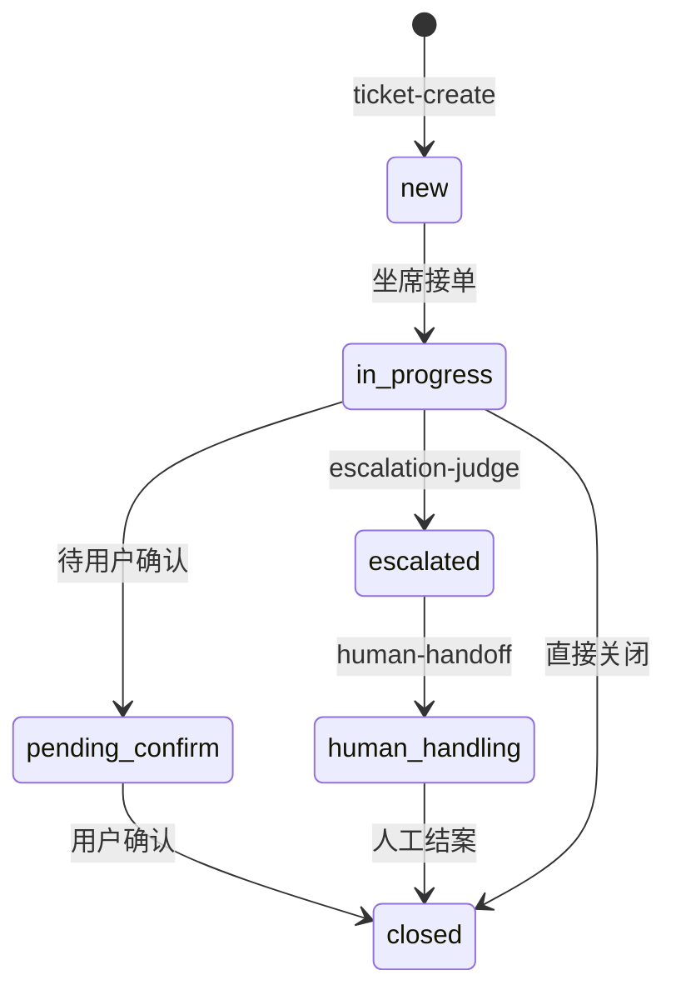

# 业务流程与工单状态机

> **DEV-007** | 2026-06-01

## 1. 端到端业务流程

```
用户进入 → 意图识别 → [咨询 | 工单 | 投诉]
  咨询 → RAG 检索 → 生成回答 → [满意结束 | 转建单]
  工单 → 字段提取 → [完整→创建 | 缺失→追问] → 返回工单号
  投诉 → 情绪分析 → 升级判断 → [可处理 | 转人工]
```

## 2. 工单状态机



| 状态 | 说明 | 允许操作 | 执行层 |
|------|------|----------|--------|
| `new` | 新建 | 查询、分配 | Tool API |
| `in_progress` | 处理中 | 更新、升级 | Tool + 规则 |
| `pending_confirm` | 待确认 | 关闭、重开 | 规则引擎 |
| `escalated` | 已升级 | 转人工 | 规则引擎 |
| `human_handling` | 人工处理 | 关闭 | 人工 |
| `closed` | 已关闭 | 只读 | — |

> **2B 约束**：状态流转由**规则引擎**执行，LLM/Skill 不得直接改状态（ADR-001）。

## 3. 异常路径

| 异常 | 触发 | 处理 |
|------|------|------|
| 字段缺失 | ticket-create 缺必填 | Skill Fallback 模板追问 |
| RAG 无命中 | 检索分数 < 阈值 | 提示转人工 + Output Guardrail |
| Tool 5xx | API 失败 | Validator 重试 3 次 → 降级 |
| 超步数 | Agent 循环 >10 步 | Step Limiter 强制终止 |
| 低置信意图 | intent-classify <0.6 | 澄清追问 |
| 敏感输入 | Guardrail 拦截 | 模板回复，不进 LLM |
| Memory 过期 | Episodic >90 天 | 不注入，提示重新描述 |

## 4. Skill 与状态机关联

| Skill | 可触发状态变更 |
|-------|---------------|
| ticket-create | → `new` |
| ticket-update | `new/in_progress` → 其他（规则校验） |
| ticket-query | 无（只读） |
| human-handoff | → `escalated` / `human_handling` |
