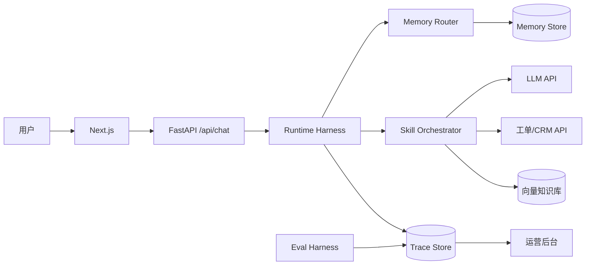

# 权限模型与数据流

> **DEV-008** | 2026-06-01

## 1. RBAC 权限矩阵

| 角色 | 对话 | 工单 CRUD | 知识库 | 运营后台 | Eval | Memory 删除 |
|------|------|-----------|--------|----------|------|-------------|
| 客户（end_user） | ✅ | 仅自己的 | 读 | ❌ | ❌ | 可申请 |
| 一线坐席 | ✅ | ✅ | 读 | 读 Trace | ❌ | ❌ |
| 客服主管 | ✅ | ✅ | 读 | ✅ 全功能 | 读报告 | ❌ |
| IT 管理员 | ❌ | 配置 | 读写 | ✅ | ✅ | ✅ |
| Agent 系统 | Tool 调用 | API | RAG 检索 | 写 Trace | 跑 Eval | Write Policy |

## 2. Skill 级权限

| Skill | 所需权限 | 拒绝时行为 |
|-------|----------|-----------|
| ticket-create | `ticket:write` | Tool 403 + 友好提示 |
| ticket-query | `ticket:read` | 仅查本人工单 |
| crm-lookup | `crm:read` | 脱敏返回 |
| human-handoff | `escalation:execute` | 规则队列 |

## 3. 数据流图



## 4. 数据分类与存储

| 数据 | 存储 | 保留 | 敏感处理 |
|------|------|------|----------|
| 对话 Working | SQLite/Redis | 会话结束归档 | — |
| Episodic 摘要 | SQLite | 90 天 | 去 PII |
| Profile | SQLite | 永久 | 脱敏展示 |
| Trace | SQLite | 180 天 | 可审计 |
| 评测集 | Git | 永久 | 无真实 PII |

## 5. 异常与权限拒绝路径

```
Tool 调用 → 权限校验失败 → Trace 记录 layer=tool
  → 不暴露内部错误 → 用户侧：「暂无权限，请联系管理员」
  → 运营侧：Bad Case 归因 → 流程层
```
